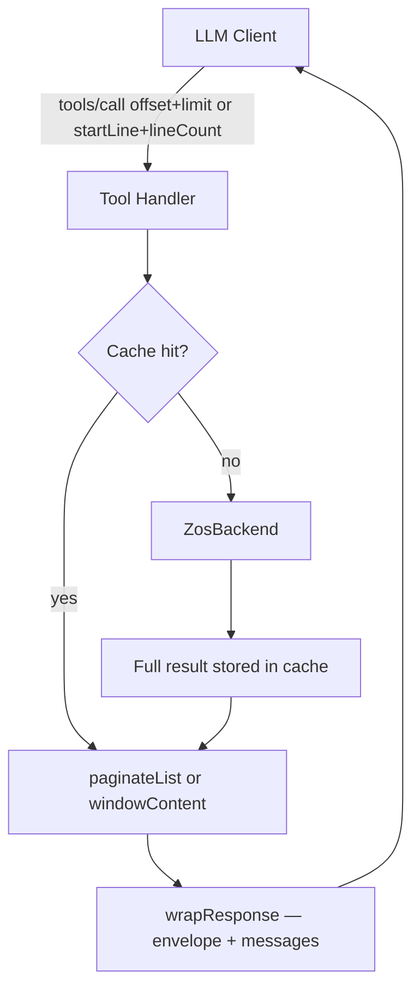

# Pagination and Search in Zowe MCP

This document describes how pagination and search work in the Zowe MCP Server — the tools involved, their parameters, the response schema, the implementation architecture, the test strategy, and lessons learned from AI evaluation runs. It is written as a reference for someone building a similar MCP server and wanting to adopt the same approach.

## Table of Contents

1. [Overview](#1-overview)
2. [Response Envelope](#2-response-envelope)
3. [List Pagination](#3-list-pagination)
4. [Line-Windowed Pagination](#4-line-windowed-pagination)
5. [Search — searchInDataset](#5-search--searchindataset)
6. [Implementation Architecture](#6-implementation-architecture)
7. [SERVER_INSTRUCTIONS — Client-Side Protocol](#7-server_instructions--client-side-protocol)
8. [Testing](#8-testing)
9. [AI Eval Sets](#9-ai-eval-sets)
10. [Empirical Findings and Known Problems](#10-empirical-findings-and-known-problems)
11. [Search Benchmark](#11-search-benchmark)
12. [Guidance for Similar MCP Server Implementations](#12-guidance-for-similar-mcp-server-implementations)

---

## 1. Overview

z/OS systems can hold data sets with thousands of members and files with tens of thousands of lines. LLM context windows are finite, and repeatedly fetching the same backend data for every page of results would be slow and expensive. Zowe MCP solves this with two independent pagination mechanisms and a dedicated search tool:

- **List pagination** (`offset` / `limit`): for operations that return a list of items — data sets, PDS members, USS directory entries, jobs, job files, job output lines, or search matches. Default page size is 500, maximum 1000.
- **Line-windowed pagination** (`startLine` / `lineCount`): for operations that return the content of a single file or command output. The window moves forward through lines. Content larger than 1000 lines is auto-truncated on the first call unless an explicit window is requested.
- **Search** (`searchInDataset`): searches for a literal string across all members of a PDS or PDS/E (or a single member, or a sequential data set). The search result is itself paginated by member using the list pagination mechanism.

All three mechanisms share a common response envelope, a response cache that prevents re-hitting the backend across pages, and an explicit directive in the response `messages` array that tells the LLM exactly what to call next.

---

## 2. Response Envelope

Every paginated tool wraps its response in a `ToolResponseEnvelope<T>` defined in `packages/zowe-mcp-server/src/tools/response.ts`:

```typescript
interface ToolResponseEnvelope<T> {
  _context: ResponseContext;   // how the input was resolved
  _result?: ResultMeta;        // pagination / windowing metadata
  messages?: string[];         // next-call directives; omitted when empty
  data: T;                     // actual payload
}
```

### 2.1 `_context`

Describes how the tool resolved the input:

| Field | Present when |
| --- | --- |
| `system` | always — the resolved z/OS hostname |
| `resolvedPattern` | input pattern was quoted or lowercase (list tools) |
| `resolvedDsn` | input DSN was quoted or lowercase (CRUD tools) |
| `resolvedTargetDsn` | target DSN differed from input (copy/rename) |
| `resolvedPath` | USS path normalization changed the input |
| `currentDirectory` | USS tools with a working directory |
| `listedDirectory` | `listUssFiles` — the directory that was listed |

Resolved values are only emitted when they differ from the trimmed raw input. This keeps the context clean for the LLM — if you passed `USER.SRC.COBOL` in uppercase without quotes, `resolvedDsn` is absent.

### 2.2 `_result` — three variants

**`ListResultMeta`** — for all list-paginated tools:

```typescript
interface ListResultMeta {
  count: number;          // items in this page
  totalAvailable: number; // total matching items before pagination
  offset: number;         // 0-based offset of first item in this page
  hasMore: boolean;       // true when more items exist beyond this page
}
```

**`ReadResultMeta`** — for all line-windowed tools:

```typescript
interface ReadResultMeta {
  totalLines: number;     // full line count of the content
  startLine: number;      // 1-based first line returned
  returnedLines: number;  // number of lines in this window
  contentLength: number;  // character count of returned text
  mimeType: string;       // inferred type (text/plain, text/x-cobol, etc.)
  hasMore: boolean;       // true when more lines exist beyond this window
}
```

**`SearchResultMeta`** — for `searchInDataset` (extends list pagination):

```typescript
interface SearchResultMeta {
  count: number;              // members in this page
  totalAvailable: number;     // total members with matches
  offset: number;
  hasMore: boolean;
  linesFound: number;         // total matching lines across ALL members
  linesProcessed: number;     // total lines read across ALL members
  membersWithLines: number;   // members with at least one match
  membersWithoutLines: number;// members with no matches
  searchPattern: string;      // the literal search string used
  processOptions: string;     // SuperC parms (e.g. "ANYC SEQ")
}
```

Note that `linesFound` / `linesProcessed` / `membersWithLines` / `membersWithoutLines` always reflect the **entire search**, not just the current page. This is because the full search runs first and is cached; pages are slices of that cached result.

### 2.3 `messages[]`

When `hasMore` is true, the response `messages` array contains an imperative next-call directive generated by `getListMessages()` or `getReadMessages()`. The field is omitted (not `[]`) when empty. Example for list pagination:

```
More results are available (showing 1–500 of 2000). You must call this tool
again with offset=500 and limit=500 to fetch the next page. Do not answer
with only partial data—keep calling until _result.hasMore is false.
```

Example for line windowing:

```
More lines are available (showing lines 1–1000 of 2500). You must call this
tool again with startLine=1001 and the same lineCount to fetch the next page.
Do not answer with only partial data—keep calling until _result.hasMore is false.
```

The imperative phrasing ("You must…") is intentional — see [Section 10](#10-empirical-findings-and-known-problems) for why it outperforms softer alternatives.

### 2.4 Zod output schemas

All paginated tools declare a Zod `outputSchema` passed to `server.registerTool`. This causes the MCP server to advertise the response shape in `tools/list` and to return `structuredContent` alongside the JSON text `content`. Clients that support it can validate responses without parsing JSON.

The schemas live in `packages/zowe-mcp-server/src/tools/datasets/dataset-output-schemas.ts` and the per-component equivalents (`uss-output-schemas.ts`, `jobs-output-schemas.ts`, `tso-output-schemas.ts`). The shared envelope helper is:

```typescript
function envelopeSchema<T extends z.ZodType>(
  dataSchema: T,
  resultSchema?: z.ZodType,
  description?: string
) {
  // base: _context + messages? + data
  // extended: + _result when resultSchema is provided
}
```

Examples:

```typescript
export const listMembersOutputSchema = envelopeSchema(
  z.array(memberEntrySchema),
  listResultMetaSchema,
  'Paginated list of PDS or PDS/E members...'
);

export const readDatasetOutputSchema = envelopeSchema(
  readDatasetDataSchema,
  readResultMetaSchema,
  'Content of a data set or member...'
);

export const searchInDatasetOutputSchema = envelopeSchema(
  searchDataSchema,
  searchResultMetaSchema,
  'Search results...'
);
```

For tool execution errors (validation failure, blocked command), the tool returns `{ content: [...], isError: true }` without `structuredContent`, so clients are not required to validate the error body against the success schema.

---

## 3. List Pagination

### 3.1 Tools

| Tool | Domain | What is paginated |
| --- | --- | --- |
| `listDatasets` | Datasets | Data sets matching a DSLEVEL pattern |
| `listMembers` | Datasets | PDS or PDS/E members |
| `searchInDataset` | Datasets | Members with matches (search results) |
| `listUssFiles` | USS | USS directory entries |
| `listJobs` | Jobs | Jobs matching filter criteria |
| `listJobFiles` | Jobs | Spool files (DDs) for a job |
| `getJobOutput` | Jobs | Lines in a spool file (by job file) |
| `searchJobOutput` | Jobs | Spool file matches |

### 3.2 Input parameters

All list-paginated tools accept:

| Parameter | Type | Default | Max | Description |
| --- | --- | --- | --- | --- |
| `offset` | `number` (int ≥ 0) | `0` | — | 0-based index of the first item to return |
| `limit` | `number` (int 1–1000) | `500` | `1000` | Maximum items to return in this page |

Constants: `DEFAULT_LIST_LIMIT = 500`, `MAX_LIST_LIMIT = 1000` (in `response.ts`).

### 3.3 How pagination is applied

The backend is called once and the full result is stored in the response cache. The tool layer slices the result using `paginateList()`:

```typescript
function paginateList<T>(
  items: T[],
  offset: number,
  limit: number
): { data: T[]; meta: ListResultMeta }
```

This means the LLM can request any page without the backend being called again (within the cache TTL). The cache key includes the system, user, pattern/DSN, and any filter parameters. When a mutation affects a data set, the relevant cache scope is invalidated so stale pages are not served.

### 3.4 Tool description pattern

Tool descriptions include a one-line pagination note inserted after the first sentence using `withPaginationNote()`:

```typescript
server.registerTool('listMembers', {
  description: withPaginationNote(
    'List members of a PDS or PDS/E data set',
    PAGINATION_NOTE_LIST
  ),
  // ...
});
```

`PAGINATION_NOTE_LIST` expands to: `"Results are paginated (default 500, max 1000 per page); follow the pagination instructions in the server instructions."` The full protocol lives in `SERVER_INSTRUCTIONS` (see Section 7) to avoid duplication across every tool description.

### 3.5 `listDatasets` additional parameters

`listDatasets` also accepts:

| Parameter | Description |
| --- | --- |
| `dsnPattern` | DSLEVEL pattern (e.g. `USER.*`, `USER.**`, `SYS1.*LIB`) |
| `volser` | Restrict to a specific DASD volume (uncataloged data sets) |
| `detail` | `minimal` / `basic` (default) / `full` — controls which fields are returned per entry |

The `detail` parameter filters fields after pagination. The backend always fetches full attributes; filtering is a tool-layer concern. This avoids separate cache entries per detail level.

### 3.6 `listMembers` additional parameters

| Parameter | Description |
| --- | --- |
| `dsn` | Fully qualified PDS or PDS/E name |
| `memberPattern` | Optional wildcard filter (e.g. `ABC*`, `A%C`); applied server-side via ZNP when available, then client-side as a fallback |

---

## 4. Line-Windowed Pagination

### 4.1 Tools

| Tool | Domain | What is windowed |
| --- | --- | --- |
| `readDataset` | Datasets | Lines of a data set or PDS member |
| `readUssFile` | USS | Lines of a USS file |
| `readJobFile` | Jobs | Lines of a spool file |
| `runSafeUssCommand` | USS | Lines of USS command output |
| `runSafeTsoCommand` | TSO | Lines of TSO command output |

### 4.2 Input parameters

| Parameter | Type | Default | Description |
| --- | --- | --- | --- |
| `startLine` | `number` (int ≥ 1) | `1` | 1-based line number of the first line to return |
| `lineCount` | `number` (int ≥ 1) | auto | Number of lines to return; when absent the first call auto-truncates at `MAX_READ_LINES = 1000` |

### 4.3 Auto-truncation behavior

On the first call (no `startLine` / `lineCount`):

- If content fits in 1000 lines, it is returned in full with `hasMore: false`.
- If content exceeds 1000 lines, the first 1000 lines are returned with `hasMore: true` and the `messages` directive tells the LLM to call again with `startLine=1001` and a chosen `lineCount`.

On subsequent calls (explicit `startLine`/`lineCount`):

- Any line range is returned exactly as requested.
- `hasMore` is true until `startLine + returnedLines >= totalLines`.

**Special case for TSO**: `runSafeTsoCommand` re-executes the command on every call that omits both `startLine` and `lineCount`. Providing `startLine` or `lineCount` pages the cached output from the previous execution. This matches user expectation — a bare call runs fresh; a paginated call continues the previous result.

### 4.4 Content sanitization

Before returning, all text is passed through `sanitizeTextForDisplay()` which replaces unprintable characters (control chars 0x00–0x1F except tab/LF/CR, DEL 0x7F, C1 controls 0x80–0x9F) with `.`. This prevents JSON encoding issues and keeps the LLM output readable when reading EBCDIC-encoded mainframe content that was not fully converted.

### 4.5 ETag for optimistic locking

`readDataset` returns an `etag` field alongside the content lines. The ETag always reflects the full content (not just the returned window). When writing back with `writeDataset`, passing the same ETag causes the write to fail if the data set was modified between the read and the write — a simple optimistic locking mechanism.

---

## 5. Search — `searchInDataset`

### 5.1 Overview

`searchInDataset` finds a literal string in a sequential data set, a PDS or PDS/E (all members, or one member). Results are structured by member: each matching member contains an array of match entries (line number + content). Search results are themselves paginated by member using list pagination.

### 5.2 Input parameters

| Parameter | Type | Default | Description |
| --- | --- | --- | --- |
| `dsn` | string | required | Fully qualified data set name; may include `(MEMBER)` suffix |
| `string` | string | required | Literal search string |
| `member` | string | optional | Limit search to a specific PDS member |
| `offset` | number | `0` | 0-based member offset for pagination |
| `limit` | number | `500` | Members per page (max 1000) |
| `encoding` | string | system default | EBCDIC encoding for reading content |
| `caseSensitive` | boolean | `false` | When true, match exact case |
| `cobol` | boolean | `false` | When true, restrict search to columns 7–72 (COBOL program area) |
| `ignoreSequenceNumbers` | boolean | `true` | When true (default), exclude columns 73–80 (card sequence numbers) |
| `doNotProcessComments` | string[] | `[]` | Comment types to exclude from matching |
| `includeContextLines` | boolean | `false` | When true, include ±6 surrounding lines per match (ZNP native only) |

`dsn` accepts `USER.LIB(MEM)` notation as shorthand for `dsn=USER.LIB, member=MEM`.

### 5.3 Search options mapping to SuperC parms

Search options are translated to a SuperC process options (parms) string by `buildParmsFromOptions()` in `packages/zowe-mcp-server/src/zos/search-options.ts`. The parms string is used both as the cache key component and as the actual search parameter sent to the backend.

| Option | Value | SuperC parm |
| --- | --- | --- |
| `caseSensitive` | `false` (default) | `ANYC` (case-insensitive) |
| `caseSensitive` | `true` | _(no ANYC)_ |
| `cobol` | `true` | `COBOL` |
| `ignoreSequenceNumbers` | `true` (default) | `SEQ` |
| `ignoreSequenceNumbers` | `false` | `NOSEQ` |
| `doNotProcessComments: ['asterisk']` | | `DPACMT` |
| `doNotProcessComments: ['cobolComment']` | | `DPCBCMT` |
| `doNotProcessComments: ['fortran']` | | `DPFTCMT` |
| `doNotProcessComments: ['cpp']` | | `DPCPCMT` |
| `doNotProcessComments: ['pli']` | | `DPPLCMT` |
| `doNotProcessComments: ['pascal']` | | `DPPSCMT` |
| `doNotProcessComments: ['pcAssembly']` | | `DPMACMT` |
| `doNotProcessComments: ['ada']` | | `DPADCMT` |
| `includeContextLines` | `true` | `LPSF` (ZNP only) |

The parms string is built in a fixed order (ANYC → COBOL → SEQ/NOSEQ → comment options → LPSF) to ensure stable cache keys regardless of the order in which the caller specifies options.

Default parms for an unmodified call: `"ANYC SEQ"` (case-insensitive, ignore sequence numbers).

### 5.4 Response data shape

```typescript
data: {
  dataset: string;  // fully qualified DSN searched
  members: Array<{
    name: string;   // member name ("" for sequential data sets)
    matches: Array<{
      lineNumber: number;       // 1-based
      content: string;          // the matching line (sanitized)
      beforeContext?: string[]; // up to 6 lines before (LPSF + ZNP only)
      afterContext?: string[];  // up to 6 lines after (LPSF + ZNP only)
    }>;
  }>;
  summary: {
    linesFound: number;
    linesProcessed: number;
    membersWithLines: number;
    membersWithoutLines: number;
    searchPattern: string;
    processOptions: string;
  };
}
```

The `summary` object always reflects the **full search** (all members), not just the current page. This lets the LLM report aggregate statistics from the first page without needing to paginate further when only counts are needed.

### 5.5 Search pagination vs. full search

The search runs completely before any page is returned. The full result is stored in the response cache keyed by `(systemId, dsn, member, string, parms, encoding)`. Subsequent calls with `offset > 0` retrieve the cached full result and slice it — the backend is never called again for the same search parameters within the cache TTL.

```
First call:  backend.searchInDataset(...) → full result → cache → slice page 1
Second call: cache hit → slice page 2  (no backend call)
```

---

## 6. Implementation Architecture

### 6.1 Data flow



### 6.2 Key source files

| File | Role |
| --- | --- |
| `src/tools/response.ts` | `ToolResponseEnvelope`, all `ResultMeta` types, `paginateList`, `windowContent`, `paginateSearchResult`, `getListMessages`, `getReadMessages`, `sanitizeTextForDisplay`, `wrapResponse`, constants |
| `src/tools/datasets/dataset-output-schemas.ts` | Zod schemas for all dataset tool outputs; shared `listResultMetaSchema`, `readResultMetaSchema`, `searchResultMetaSchema`; `envelopeSchema` helper |
| `src/zos/response-cache.ts` | `createResponseCache` (LRU, TTL, size limit), `buildCacheKey`, scope-based invalidation (`buildScopeSystem`, `buildScopeDsn`), `withCache` helper |
| `src/zos/search-runner.ts` | `runSearchWithListAndRead` — in-process fallback (listMembers → read each → grep) |
| `src/zos/search-options.ts` | `buildParmsFromOptions`, `SEARCH_COMMENT_TYPES` |
| `src/tools/datasets/dataset-tools.ts` | `registerDatasetTools` — wires all dataset tools with cache, pagination, and search |
| `src/server.ts` | `SERVER_INSTRUCTIONS` — pagination protocol sent to clients at init |

### 6.3 Response cache

The response cache (`src/zos/response-cache.ts`) is an in-memory LRU cache:

- **Default TTL**: 10 minutes
- **Default max size**: 1 GB (measured as the serialized JSON byte size of each value)
- **Implementation**: `lru-cache` npm package with `sizeCalculation` callback

Cache keys are built by `buildCacheKey(prefix, params)` which serializes params as JSON with sorted keys, ensuring a stable key regardless of call order. Example key for `listDatasets`:

```
listDatasets\x01{"pattern":"USER.**","systemId":"mainframe.example.com","userId":"USER","volser":""}
```

**Scope-based invalidation**: when a mutation (write, create, delete) affects a data set or member, the tool calls `cache.invalidateScope(scopeKey)`. Scopes are:

- `system:<systemId>` — invalidates all `listDatasets` results for a system
- `dsn:<systemId>:<dsn>` — invalidates `listMembers`, `readDataset`, `searchInDataset` for a specific DSN

This means that after `writeDataset` on `USER.SRC.COBOL(CUSTFILE)`, any cached `readDataset` or `searchInDataset` result for `USER.SRC.COBOL` is evicted on the next call.

Cache can be disabled at startup via `--response-cache-disable` or `ZOWE_MCP_RESPONSE_CACHE_DISABLE=1`. TTL and max size are also configurable via CLI flags, env vars, or `CreateServerOptions`.

### 6.4 Two search backends

Search uses one of two backends depending on the SDK version available:

**ZNP native `tool.search`** (SDK ≥ 0.3.0 from PR #809):

- Sends a single RPC to the z/OS ZNP server
- ZNP runs IBM SuperC on z/OS and returns structured match results
- Supports all search parms including LPSF (context lines)
- Detected at runtime: `(client as unknown as { tool?: NativeToolApi }).tool?.search`
- Response is mapped via `mapZnpSearchResponse()` in `native-backend.ts`

**Fallback** (in-process, `search-runner.ts`):

- `listMembers(systemId, dsn)` to get member names
- `readDataset(systemId, dsn, member, encoding)` for each member
- `grepLines(text, searchString, parms)` in JavaScript
- Used by the mock backend, SDK < 0.3.0, or when `ZOWE_MCP_SEARCH_FORCE_FALLBACK=1`
- Does not support LPSF (context lines); `includeContextLines` is silently ignored

See [Section 11](#11-search-benchmark) for performance comparison.

---

## 7. SERVER_INSTRUCTIONS — Client-Side Protocol

The server sends `SERVER_INSTRUCTIONS` to MCP clients during protocol initialization via `ServerOptions.instructions`. Clients that include this in the LLM system prompt give the LLM the full pagination protocol upfront, without needing to infer it from tool descriptions.

The instructions describe both pagination variants:

```
Zowe MCP Server — Pagination Protocol

Many tools return paginated results. The response envelope contains a _result
object with a hasMore boolean.

List pagination (listDatasets, listMembers, searchInDataset, listUssFiles,
listJobs, listJobFiles, getJobOutput, searchJobOutput):
- When _result.hasMore is true, call the tool again with
  offset = current offset + _result.count and the same limit.

Line-windowed pagination (readDataset, readUssFile, readJobFile,
runSafeUssCommand, runSafeTsoCommand):
- When _result.hasMore is true, call the tool again with
  startLine = _result.startLine + _result.returnedLines and the same lineCount.

If the task requires more data, do not answer with only the first page/window;
keep calling until _result.hasMore is false.
The response messages array contains the exact parameters for the next call
when more data is available.
```

Tool descriptions add only a short one-line reference via `withPaginationNote()` (placed after the first sentence) to avoid duplicating the full protocol in every tool. The LLM sees the full protocol from `SERVER_INSTRUCTIONS` and a reminder in each tool's description.

---

## 8. Testing

### 8.1 Unit tests

**`search-options.test.ts`**

Covers `buildParmsFromOptions` exhaustively:

- Default (no options) → `"ANYC SEQ"`
- `caseSensitive: true` → no ANYC
- `cobol: true` → `"ANYC COBOL SEQ"`
- `ignoreSequenceNumbers: false` → `"ANYC NOSEQ"`
- `doNotProcessComments: ['asterisk', 'cobolComment']` → `"ANYC SEQ DPACMT DPCBCMT"`
- `includeContextLines: true` → `"ANYC SEQ LPSF"`
- Combined options

**`search-runner.test.ts`**

Covers `runSearchWithListAndRead` with a mock `SearchBackendAdapter`:

- Sequential data set (listMembers throws → read once and grep)
- PDS with multiple members (list → read each → collect matches)
- `filterMember` limit to one member
- Case-sensitive vs case-insensitive
- COBOL column restriction

**`native-backend.test.ts`**

Covers the ZNP search integration:

- `searchInDataset` with a fake `tool.search` RPC (ZNP path)
- `searchInDataset` without `tool` property (fallback path)
- LPSF context lines — `beforeContext`/`afterContext` present in response
- `ZOWE_MCP_SEARCH_FORCE_FALLBACK=1` forces fallback even when `tool.search` exists

**`dataset-tools.test.ts`**

Integration tests with `FilesystemMockBackend` and an in-memory MCP client:

- Pagination envelope structure: `_context`, `_result.count`, `_result.totalAvailable`, `_result.hasMore`, `messages`
- `offset` and `limit` parameters slice the result correctly
- `hasMore` is false on the last page
- `messages` is omitted when `hasMore` is false
- `searchInDataset` envelope: `_result.linesFound`, `data.dataset`, `data.members`, `data.summary`
- Search result cache: same parameters on the second call return cached data (no backend call)

### 8.2 E2E tests

**`mock-stdio.e2e.test.ts`**

Three describe blocks that start a real stdio server process:

1. **Default mock session** (`--preset default`): verifies `listDatasets`, `listMembers`, and `searchInDataset` tool responses including envelope shape, `_context.system`, `_result` fields, and `data.summary.searchPattern`.

2. **`listMembers` pagination with inventory preset** (`--preset inventory`, 2000 members):
   - Page 1: offset=0, limit=500 → `_result.count=500`, `_result.totalAvailable=2000`, `_result.hasMore=true`, first member `ITEM0001`, last member `ITEM0500`
   - Page 2: offset=500, limit=500 → `_result.offset=500`, first member `ITEM0501`
   - Last page: offset=1999, limit=10 → `_result.count=1`, `_result.hasMore=false`, last member `ITEM2000`

3. **`readDataset` pagination with pagination preset** (`--preset pagination`, 2500-line `USER.LARGE.SEQ`):
   - First call: `startLine=1`, `lineCount=1000` → `_result.returnedLines=1000`, `_result.hasMore=true`
   - Subsequent calls advance `startLine` until `hasMore=false`
   - A hidden string ("LUKE") is planted past line 1000 so the test verifies the agent must page to find it

**`response-cache-stdio.e2e.test.ts`**

- Two server processes: one with cache enabled (default), one with `--response-cache-disable`
- Both run the same `listDatasets` pagination sequence
- With cache: backend is called once; subsequent pages are cache hits (verified by a `CountingBackend` wrapper in unit tests)
- Without cache: each page call hits the backend

### 8.3 Mock data presets

`init-mock` supports a `--preset` flag that generates data at a scale appropriate for pagination testing:

| Preset | What it generates |
| --- | --- |
| `inventory` | 2000-member `USER.INVNTORY` PDS (for listMembers 4-page test) |
| `pagination` | `inventory` + 1000 `USER.PEOPLE.*` sequential data sets + 2500-line `USER.LARGE.SEQ` |

People data sets are `USER.PEOPLE.firstname.lastname` (sequential). Names are unique, English, no special characters, max 8 chars per part. Both use `--seed 42` (default) for reproducible Faker data.

---

## 9. AI Eval Sets

The project uses YAML-defined question sets run against the MCP server to validate that the LLM correctly uses pagination and search. Each question has a natural-language `prompt` and one or more `assertions` that check which tools were called and with what arguments.

### 9.1 `pagination.yaml`

Tests that the LLM makes the correct number of calls with the correct `offset` values when paginating through large results. Uses `toolCallOrder` assertions (ordered sequence of expected tool calls).

**Question: listMembers of USER.INVNTORY (2000 members, 4 pages)**

```yaml
prompt: List members of USER.INVNTORY
assertions:
  - toolCallOrder:
      - tool: listMembers
        args: { validDsn: "USER.INVNTORY" }               # page 1: offset 0
      - tool: listMembers
        args:
          - { validDsn: "USER.INVNTORY", offset: 500 }    # page 2
      - tool: listMembers
        args:
          - { validDsn: "USER.INVNTORY", offset: 1000 }   # page 3
      - tool: listMembers
        args:
          - { validDsn: "USER.INVNTORY", offset: 1500 }   # page 4
  - answerContains:
      pattern: "2,?000"  # final answer must mention "2000"
```

**Question: listDatasets USER.PEOPLE (1000 data sets, 2 pages)**

```yaml
prompt: List data sets under USER.PEOPLE
assertions:
  - toolCallOrder:
      - tool: listDatasets
        args: { dsnPattern: "USER.PEOPLE.*" }
      - tool: listDatasets
        args: { dsnPattern: "USER.PEOPLE.*", offset: 500 }
  - answerContains:
      pattern: "1,?000"
```

Config: `repetitions: 2`, `minSuccessRate: 0.8`, mock `--preset pagination`.

### 9.2 `read-pagination.yaml`

Tests that the LLM reads past the first page to find content planted deep in a file.

```yaml
prompt: Read USER.LARGE.SEQ and tell me what Star Wars character name appears in it.
assertions:
  - toolCall:
      tool: readDataset
      minCount: 2          # must call at least twice
  - answerContains:
      substring: "LUKE"    # planted past line 1000
```

Config: `repetitions: 2`, `minSuccessRate: 0.8`, mock `--preset pagination`.

### 9.3 `search.yaml`

Tests basic search tool invocation with correct DSN and string.

```yaml
- id: search-in-pds
  prompt: Search for the string DIVISION in data set USER.SRC.COBOL and tell me what you find.
  assertions:
    - toolCall:
        tool: searchInDataset
        args:
          validDsn: "USER.SRC.COBOL"
          string: "DIVISION"
    - answerContains:
        pattern: "DIVISION|found|matches|members"

- id: search-in-member
  prompt: Search for PROCEDURE in member CUSTFILE of USER.SRC.COBOL.
  assertions:
    - toolCall:
        tool: searchInDataset
        args:
          validDsn: "USER.SRC.COBOL(CUSTFILE)"
          string: "PROCEDURE"
```

Config: `repetitions: 2`, `minSuccessRate: 0.8`, mock `--preset default`.

### 9.4 `search-pagination.yaml`

Tests that the LLM pages through a large search result (2000 members).

```yaml
prompt: Search for the string "name:" in data set USER.INVNTORY and count how many of the all matched content are clothes.
assertions:
  - toolCall:
      tool: searchInDataset
      minCount: 2              # must call at least twice to page
  - toolCall:
      tool: searchInDataset
      args:
        validDsn: "USER.INVNTORY"
        string: "name"
  - answerContains:
      substring: "2000"        # must process all 2000 members
```

Config: `repetitions: 2`, `minSuccessRate: 0.8`, mock `--preset pagination`.

### 9.5 `description-quality.yaml`

Eleven questions testing edge cases in how well tool descriptions guide the LLM. Pagination-related questions:

| Question | What it tests |
| --- | --- |
| `metadata-member-count` | Use `_result.totalAvailable` to answer "How many members?" without paging all results |
| `metadata-dataset-count` | Same for data sets |
| `search-case-sensitive` | Pass `caseSensitive: true` |
| `search-ignore-sequence-numbers` | Pass `ignoreSequenceNumbers: true` |
| `search-cobol-mode` | Pass `cobol: true` |
| `search-with-context-lines` | Pass `includeContextLines: true` |
| `search-combined-options` | Pass `cobol: true` + `ignoreSequenceNumbers: true` together |
| `read-first-lines` | Pass `lineCount: 10` to limit the read |
| `read-specific-range` | Pass `startLine: 20` |
| `search-single-member` | Use `USER.SRC.COBOL(CUSTFILE)` DSN notation to limit search to one member |

Config: `repetitions: 10`, `minSuccessRate: 0.5`, mock `--preset pagination`.

### 9.6 Running the eval sets

```bash
# Single set
npm run evals -- --set pagination
npm run evals -- --set search,search-pagination,read-pagination
npm run evals -- --set description-quality

# Cross-model comparison with auto-updated scoreboard
npm run eval-compare -- --set pagination,read-pagination,search,search-pagination,description-quality --label "baseline"
```

---

## 10. Empirical Findings and Known Problems

This section documents what was learned through AI evaluation runs. Sources: `docs/eval-model-comparison-2026-03-05.md` and `docs/eval-scoreboard.md`.

### 10.1 Pagination is the hardest category for LLMs

From the 2026-03-05 three-model comparison (Qwen3 30B, Gemini 3 Flash, Gemini 2.5 Flash):

| Set | Qwen3 30B | Gemini 3 Flash | Gemini 2.5 Flash |
| --- | --- | --- | --- |
| pagination | **100%** | 25% | 50% |
| read-pagination | **100%** | **100%** | 50% |
| search-pagination | **100%** | **100%** | 50% |

List pagination (`pagination` set) is the hardest: Gemini 3 Flash scored only 25% despite being a strong model overall (95.3% total). The failure mode is consistent — the LLM answers after the first page rather than continuing to paginate. Models with explicit reasoning/thinking capabilities (Qwen3, Gemini 3 Flash on read/search) handle it better.

### 10.2 The `messages[]` directive design

Before the `messages` array was introduced, pagination instructions were embedded only in `_result` fields and `SERVER_INSTRUCTIONS`. The scoreboard shows the impact of different approaches (label `before-desc-reorder` vs `after-desc-reorder`, Qwen3):

| Label | search-pagination |
| --- | --- |
| `before-desc-reorder` | 80% (4/5) |
| `after-desc-reorder` | 100% (5/5) |

The `messages` array with a strong imperative directive was the change that moved `search-pagination` from 80% to 100%. Key design decisions:

- **Imperative phrasing**: "You must call this tool again…" not "You may call…" or "Consider calling…"
- **Include the exact next parameters**: spell out `offset=500 and limit=500` rather than just saying "call again"
- **Include the termination condition**: "…until `_result.hasMore` is false"
- **Omit `messages` entirely when `hasMore` is false** — reduces noise

### 10.3 `SERVER_INSTRUCTIONS` tradeoff

Adding the full pagination protocol to `SERVER_INSTRUCTIONS` (label `with-server-instructions`) showed an unexpected tradeoff:

| Label | naming-stress | description-quality | search-pagination |
| --- | --- | --- | --- |
| `before-desc-reorder` | 97.8% | 67.3% | 80% |
| `with-server-instructions` | 100% | 20% | 100% |

Adding pagination protocol to `SERVER_INSTRUCTIONS` improved `naming-stress` to 100% and `search-pagination` to 100%, but collapsed `description-quality` to 20%. The hypothesis is that when the system prompt is heavily loaded with pagination instructions, the model becomes overly focused on pagination and ignores other tool selection details.

The settled design: `SERVER_INSTRUCTIONS` contains the full pagination protocol, individual tool descriptions carry only a short one-line `withPaginationNote()` reference. This balances protocol awareness without over-weighting it.

### 10.4 Renaming the `string` parameter caused a regression

An experiment renaming `string` to `searchString` in `searchInDataset` (label `after-rename-searchString`):

| Label | naming-stress |
| --- | --- |
| `baseline` | 100% (54/54) |
| `after-rename-searchString` | 94.4% (51/54) |

The LLM reads the `.describe()` text primarily, not the parameter key name. The original description `"Search string (literal) to find in the data set or members"` was already sufficient context. Renaming the key did not help and introduced regressions on questions that used phrasing like "find all occurrences of X". The parameter name was reverted to `string`.

### 10.5 Expanding jargon in descriptions improved search quality

Adding full names and column numbers to search parameter descriptions (label `after-param-descriptions`):

| Label | description-quality |
| --- | --- |
| `baseline` | 63.6% (21/33) |
| `after-param-descriptions` | 72.7% (24/33) |

Effective changes:

- `cobol`: `"search cols 7–72 only (the COBOL program text area, skipping the line-number area in columns 1–6)"`
- `ignoreSequenceNumbers`: `"exclude columns 73–80 from search. Columns 73–80 are the traditional card sequence-number field in fixed-length records"`
- `includeContextLines`: explicit mention that it is `"via SuperC LPSF"` and only effective with ZNP

### 10.6 Combined search options are a persistent weak spot

All models drop parameters when asked to combine multiple search options:

- "Do a case-insensitive COBOL-aware search, ignoring sequence numbers" — models often emit `cobol: true` but forget `ignoreSequenceNumbers: true`
- `ignoreSequenceNumbers` vs `cobol` confusion: both relate to column handling; models conflate them

This was partially improved by the column-number descriptions above, but remains below 100% for the `description-quality` set (92.7% for Qwen3, 94.5% for Gemini 3 Flash).

### 10.7 `totalAvailable` shortcut is underutilized

When asked "How many members does USER.INVNTORY have?", the LLM sometimes pages through all 2000 members rather than reading `_result.totalAvailable` from the first response. This is a pure token waste — the total is available immediately.

The `description-quality` set includes `metadata-member-count` and `metadata-dataset-count` specifically to exercise this. Strong models (Qwen3, Gemini 3 Flash) handle it reliably; Gemini 2.5 Flash sometimes over-paginates.

---

## 11. Search Benchmark

Date: 2026-03-03. Dataset: `SYS1.PARMLIB` (169 members). Search string: `"SYSTEM"`. System: ZD&T.

| Metric | ZNP `tool.search` | Fallback (list+read+grep) |
| --- | --- | --- |
| Wall-clock time | **8527 ms** | **124186 ms** |
| Lines found | 229 | 229 |
| Lines processed | 66721 | 70061 |
| Members with matches | 42 | 42 |
| Members without matches | 127 | 127 |
| Pages fetched | 1 | 1 |
| **Speedup** | **14.56x** | — |

**Analysis**: ZNP `tool.search` sends a single RPC to the z/OS ZNP server, which invokes IBM SuperC natively on the mainframe. SuperC processes the entire PDS in one pass and returns structured match results. The fallback must list members, read each one individually over SSH, and grep in JavaScript — 127 members with no matches are still read in full before being discarded.

The functional result is identical (229 lines found). The speedup grows with member count and member size. For a 1000-member PDS the speedup would be proportionally larger.

To run the benchmark locally:

```bash
ZOWE_MCP_SEARCH_BENCHMARK=1 npx vitest run search-benchmark --testTimeout=300000
```

Set `ZOWE_MCP_SEARCH_BENCHMARK_DSN` and `ZOWE_MCP_SEARCH_BENCHMARK_STRING` to customize the target data set and search string. Requires `native-config.json` and `ZOWE_MCP_PASSWORD_*` (or `ZOS_PASSWORD`) in the environment.

---

## 12. Guidance for Similar MCP Server Implementations

The design decisions in Zowe MCP were validated empirically across thousands of LLM evaluation runs. The following patterns can be adopted by any MCP server that needs to return large paginated results.

### 12.1 Use a uniform response envelope

Wrap every tool response in a consistent structure:

```json
{
  "_context": { "system": "...", "resolvedX": "..." },
  "_result": { "count": 500, "totalAvailable": 2000, "offset": 0, "hasMore": true },
  "messages": ["You must call this tool again with offset=500..."],
  "data": [ ... ]
}
```

- Use `_` prefix for metadata fields to visually separate them from the payload.
- Include `_context` (how the input was resolved) and `_result` (pagination summary) as separate objects so the LLM can access them independently.
- Only include resolved values in `_context` when they actually differed from the raw input — avoids noise.

### 12.2 Add `messages[]` with an imperative next-call directive

`_result.hasMore: true` alone is often ignored by LLMs. The `messages` array with a directive stating the exact next call parameters is significantly more reliable. Guidelines:

- Use imperative language: "You must call this tool again with…"
- Include exact parameter values: `offset=500 and limit=500`, not just "call again with the next offset"
- Include the termination condition: "…until `_result.hasMore` is false"
- Include what the user will miss: "Do not answer with only partial data—keep calling…"
- Omit `messages` entirely (not `[]`) when there is nothing more — avoids false urgency

### 12.3 Cache the full backend result; slice in the tool layer

Never hit the backend again for a subsequent page of the same query. This is critical for both performance and correctness:

- **Performance**: backend calls over network (SSH, HTTP) are expensive. A 1000-member PDS read is seconds; a cache lookup is microseconds.
- **Correctness**: if the backend result changes between pages (e.g. a member is added), the LLM sees a consistent snapshot within the TTL.

Use an in-memory LRU cache keyed by stable parameters (system, user, DSN/pattern, filters). Use scope-based invalidation so mutations evict only the relevant entries.

For search specifically: always run the entire search first, cache the full result, then paginate over members. This ensures `summary` statistics are always correct regardless of which page is requested.

### 12.4 Send the full pagination protocol in `ServerOptions.instructions`

Place the pagination protocol in `instructions` (or equivalent system-level context), not in every tool description. Tool descriptions should have only a short one-line reminder. The tradeoff:

- Putting full instructions in every tool description causes the LLM to over-weight pagination concerns and ignore other details.
- Having it only in system instructions works when the client includes the instructions in the system prompt (VS Code Copilot does; some others may not).
- Short per-tool note via `withPaginationNote()` as a fallback provides the reminder even without system instructions.

### 12.5 Expose `totalAvailable` for count-without-pagination use cases

Many user questions are just "how many X exist?" The answer is immediately available in `_result.totalAvailable` on the first page. Expose it prominently and mention it in the tool description so the LLM knows it can answer count questions without paginating the full result.

### 12.6 Declare `outputSchema` (Zod or JSON Schema)

Declaring the output schema in `registerTool` causes `tools/list` to advertise the response structure. This enables:

- Clients to validate `structuredContent` without parsing JSON
- The LLM to know in advance what fields to expect
- IDE tooling to autocomplete over tool responses

For error responses, return `{ content: [...], isError: true }` without `structuredContent` so clients do not attempt to validate error bodies against the success schema.

### 12.7 Use `sanitizeTextForDisplay` for mainframe content

Any text read from EBCDIC-encoded mainframe systems may contain characters that are valid in EBCDIC but map to control characters in UTF-8. Replace these with `.` before including in JSON responses. This prevents JSON serialization failures and keeps the output readable.

### 12.8 Include `mimeType` in read responses

The inferred `mimeType` (`text/plain`, `text/x-cobol`, `text/x-jcl`, etc.) helps clients apply syntax highlighting and helps the LLM apply domain knowledge (e.g. "this is COBOL, so column structure matters").

### 12.9 Summary of key constants

| Constant | Value | Description |
| --- | --- | --- |
| `DEFAULT_LIST_LIMIT` | `500` | Default page size for list operations |
| `MAX_LIST_LIMIT` | `1000` | Maximum page size for list operations |
| `MAX_READ_LINES` | `1000` | Auto-truncation limit on first read call |
| Cache TTL | `600,000 ms` | Default: 10 minutes |
| Cache max size | `1,073,741,824 bytes` | Default: 1 GB |
