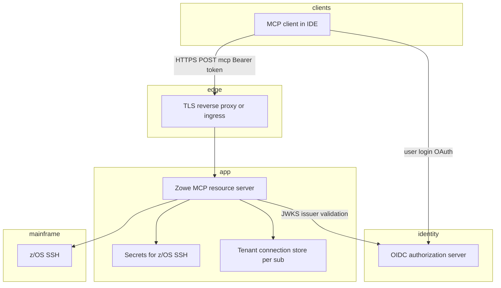

# Remote HTTP MCP: registry registration and local coexistence

This document describes how to **register** a Zowe MCP server deployed as an **HTTP Streamable** endpoint in an MCP registry (or client config), and how to **use it next to** a **local stdio** server without conflicts.

## On-premises and per-organization URLs

Remote HTTP MCP is typically deployed **on-premises** (or in a private cloud). **Each organization (“shop”) has its own base URL, hostname, and often its own TLS certificate and reverse proxy.** There is no single global URL for the Zowe MCP HTTP endpoint in the registry metadata—publishers document the **shape** of the connection (`remotes`, headers, auth), and each customer replaces the example hostname with **their** internal FQDN (for example `https://zowe-mcp.corp.example.com/mcp` vs `https://mcp.mainframe.team-b.example.org/mcp`). Private enterprise registries usually store **one `server.json` per deployment** or use templated docs where the URL is filled in at install time.

## Public registry: `packages` (stdio) vs `remotes` (HTTP)

The [official MCP registry](https://registry.modelcontextprotocol.io) is a **metadata catalog**. For Zowe MCP, the committed **[`packages/zowe-mcp-server/server.json`](../packages/zowe-mcp-server/server.json)** describes **stdio** installation from npm (`@zowe/mcp-server`)—no per-customer hostname. That is the natural **vendor-neutral** listing for a global audience.

**`remotes`** entries point clients at a **specific HTTPS MCP endpoint**. For the **official public** registry, upstream rules require that endpoint to be **publicly reachable** after any URL resolution (see [Publishing Remote Servers](https://modelcontextprotocol.io/registry/remote-servers)). **Intranet-only** deployments belong in a **private** enterprise registry, **Helm-/installer-generated** `server.json` per site, or **manual** `mcp.json`—not as a single universal public URL.

## Prerequisites

- A reachable **HTTPS URL for your deployment’s** MCP endpoint (path is usually `/mcp`; port **7542** on the app or another port if the load balancer terminates TLS and routes by hostname).
- **OIDC / Bearer JWT** at the gateway or on the server (`ZOWE_MCP_JWT_ISSUER`, `ZOWE_MCP_JWKS_URI`, optional `ZOWE_MCP_JWT_AUDIENCE`) for multi-user deployments. Client requests must send `Authorization: Bearer <access_token>` on every `/mcp` call when JWT is enabled.
- Optional **`ZOWE_MCP_TENANT_STORE_DIR`**: directory for per-user (`sub`) JSON files listing z/OS SSH connection strings in isolation (each OIDC subject has a separate file). Startup **`--config` / `--system`** lists are optional and intended mainly for **testing/bootstrap**; **recommended** operation is **`addZosConnection`** so users add their own connections. See **`AGENTS.md`** (tenant connection persistence).
- **mTLS** may be considered in the future as an additional option; it is not required for the steps below.

## Enterprise topology (shared Streamable HTTP and OAuth)

**`docs/mcp-authentication-oauth.md`** describes OAuth / OIDC at the MCP layer, GitHub Copilot / VS Code client behavior, z/OS SSH credentials, multi-tenant deployment models, and container/registry examples. The diagram below summarizes a **typical** shared **HTTPS** endpoint: users sign in to your **OIDC provider**, MCP clients send **Bearer** access tokens on **Streamable HTTP**, the server validates JWTs and scopes tenant state by **`sub`**, and **z/OS** credentials come from your platform secrets story, not from the IdP access token alone.



**Diagram boxes (short):**

- **MCP client in IDE** — The chat or MCP-enabled app (for example VS Code or Cursor) that speaks **Streamable HTTP** to `/mcp`, runs the **OAuth** login in the browser against your IdP when needed, and sends **`Authorization: Bearer`** on tool calls. Further reading: [Remote HTTP MCP with local Keycloak](remote-dev-keycloak.md) (browser OAuth and Inspector), and [Authentication and OAuth for Zowe MCP](mcp-authentication-oauth.md) (Copilot, gallery, Bearer headers).
- **OIDC authorization server** — Your organization’s **identity provider** (Azure AD, Okta, Keycloak, etc.): issues **access tokens**; it is **not** embedded in Zowe MCP. The MCP server validates JWTs using **`ZOWE_MCP_JWT_ISSUER`** and **`ZOWE_MCP_JWKS_URI`** (resource-server pattern). Further reading: [OIDC and TinyAuth-style setup](dev-oidc-tinyauth.md), [Authentication and OAuth for Zowe MCP](mcp-authentication-oauth.md) (resource server policy).
- **TLS reverse proxy or ingress** — Terminates **HTTPS** from clients and forwards plain HTTP to the Node listener (or balances across replicas). Sets **`Host`** and **`X-Forwarded-Proto`** so OAuth discovery and password-elicit URLs match the public URL. Further reading: [HTTPS, reverse proxies, and public URLs](#https-reverse-proxies-and-public-urls) below, [local HTTPS dev with Docker nginx](../docker/remote-https-dev/README.md).
- **Zowe MCP resource server** — The **`@zowe/mcp-server`** process in **`--http`** mode: **MCP Streamable HTTP** session handling, optional Bearer JWT verification, tools, and native SSH to z/OS. It validates tokens but does **not** issue them. Further reading: root [**`AGENTS.md`**](../AGENTS.md) (HTTP transport, JWT, component tools).
- **Tenant connection store per sub** — On-disk JSON per **OIDC `sub`** listing **user@host** connection strings for z/OS (`ZOWE_MCP_TENANT_STORE_DIR`), isolated per signed-in user; use **`addZosConnection`** in shared deployments. Further reading: [**`AGENTS.md`**](../AGENTS.md) (tenant connection persistence, `addZosConnection`).
- **Secrets for z/OS SSH** — Platform-supplied **passwords or key material** for SSH (for example **`ZOWE_MCP_CREDENTIALS`**, **`ZOWE_MCP_PASSWORD_*`**, Vault KV, Kubernetes secrets), **not** the OAuth access token. Further reading: [**`AGENTS.md`**](../AGENTS.md) (standalone env passwords, Vault), [Future z/OS identity and OIDC subject mapping](future-zos-identity-mapping.md) (why chat identity and SAF user are separate concerns).
- **z/OS SSH** — The mainframe side reached by **Zowe Remote SSH** over **SSH** from the MCP server only; **no OAuth** on the wire to z/OS. Further reading: [**`AGENTS.md`**](../AGENTS.md) (native SSH backend, ZNP).

The **IdP** is only used for **OAuth tokens and JWKS** at the MCP HTTP layer. **z/OS** is reached by **SSH from the MCP server** only; LPARs do not participate in OIDC.

Zowe MCP is a **resource server** only: it does **not** host the authorization server UI. Token issuance stays in your IdP or gateway product.

## 1. Publish or host `server.json` metadata

Your organization’s MCP registry (or the [official registry](https://registry.modelcontextprotocol.io)) expects a `server.json` that describes how clients connect.

For a **remote HTTP** deployment, add a `remotes` entry with `type: streamable-http` (or the schema’s equivalent for your registry version) and **the HTTPS URL for that specific deployment** (hostname and path are unique per site):

```json
{
  "name": "io.github.zowe/zowe-mcp-server",
  "title": "Zowe MCP Server (team)",
  "description": "Internal z/OS MCP — data sets, jobs, USS.",
  "version": "0.8.0",
  "remotes": [
    {
      "type": "streamable-http",
      "url": "https://zowe-mcp.tools.example.com/mcp",
      "headers": [
        {
          "name": "Authorization",
          "description": "Bearer access token from your OIDC provider (same as ZOWE_MCP JWT validation)",
          "isSecret": true,
          "isRequired": true
        }
      ]
    }
  ]
}
```

The `url` above is **illustrative only**—substitute your on-prem (or private) hostname and path. Adjust `name`, `version`, and all connection details to match **your** deployment. If the registry schema uses different property names, align with [MCP registry server schema](https://github.com/modelcontextprotocol/registry) and your vendor’s docs.

### URL template variables

The MCP registry supports **`{placeholders}`** in `remotes[].url` with a sibling **`variables`** map so **clients** (gallery or install UI) can collect values and build the final URL at **configuration time**. See the authoritative **[URL Template Variables](https://modelcontextprotocol.io/registry/remote-servers#url-template-variables)** section (schema `2025-12-11`).

**There is no publish-time substitution:** `mcp-publisher` and the registry **do not** replace placeholders when you upload a manifest. Templates are appropriate when the **same** published entry is meant for many tenants or regions and each user’s IDE resolves variables (typical **public** SaaS-style endpoints). The **resolved** URL must still satisfy the registry’s rules (for the **official public** catalog, that includes **public accessibility** after resolution).

**On-premises MCP servers** usually need a **fixed** FQDN per deployment. For private enterprise catalogs, publish a `server.json` whose `remotes[].url` is already a **concrete** `https://…` (one manifest per site, or a file generated by your Helm/installer **before** upload). Do not rely on `{placeholders}` in published metadata for internal-only hostnames unless your client is known to prompt for those variables.

### On-premises customer deployment example

Customers often deploy MCP behind their own hostname and optional reverse-proxy path. A **naive** pattern `https://{hostname}/{optionalPath}/mcp` produces a **double slash** (`https://host//mcp`) when the optional segment is empty. Prefer a **single path-prefix variable** that is either empty or starts with `/`:

```json
{
  "type": "streamable-http",
  "url": "https://{onPremHostname}{pathPrefix}/mcp",
  "variables": {
    "onPremHostname": {
      "description": "HTTPS virtual host for your Zowe MCP deployment (FQDN only, no scheme), e.g. zowe-mcp.corp.example.com",
      "isRequired": true
    },
    "pathPrefix": {
      "description": "Optional path prefix before /mcp. Use empty string for https://<host>/mcp, or e.g. /internal/zowe for https://<host>/internal/zowe/mcp",
      "isRequired": false,
      "default": ""
    }
  },
  "headers": [
    {
      "name": "Authorization",
      "description": "Bearer access token from your OIDC provider (same issuer as ZOWE_MCP_JWT_ISSUER on the server)",
      "isSecret": true,
      "isRequired": true
    }
  ]
}
```

JWT, reverse-proxy, and **`ZOWE_MCP_OAUTH_RESOURCE`** / **`ZOWE_MCP_PUBLIC_BASE_URL`** are covered in [HTTPS, reverse proxies, and public URLs](#https-reverse-proxies-and-public-urls) and in [Remote HTTP MCP with local Keycloak](remote-dev-keycloak.md).

### Local registry and HTTPS dev stack

To exercise **gallery + `remotes`** against this repo’s Keycloak HTTPS flow, run a **v0.1-spec** private registry (see **`docs/mcp-registry-research.md`** §9) and register a `server.json` whose `remotes[0].url` matches **your** dev MCP URL (for example from **`npm run start:remote-https-dev-native-zos`**: `https://zowe.mcp.example.com:7542/mcp` with **`/etc/hosts`** and **mkcert** per **`docker/remote-https-dev/README.md`**). Point the IDE MCP gallery at that registry URL. That still uses **one concrete hostname** for your machine—it validates coexistence with stdio and remote HTTP, not a single global on-prem hostname.

## 2. Register with the registry operator

Typical steps (vary by registry):

1. **Official registry** — Follow the publishing flow in the [MCP registry repository](https://github.com/modelcontextprotocol/registry): submit or update the `server.json`, link the npm package or deployment proof as required.
2. **Private / enterprise registry** — Upload a `server.json` to **your** catalog (e.g. Azure API Center, self-hosted registry) with **your** internal MCP base URL so it appears in the IDE gallery when `chat.mcp.gallery.serviceUrl` (or equivalent) points at that catalog. Large enterprises often maintain **separate** registry entries or environments per division when hostnames differ.

## 3. Point the IDE at the registry (if applicable)

In **VS Code**, set the MCP gallery to your registry URL when using a private catalog (see **`docs/mcp-registry-research.md`** §9–§11). **Copilot / VS Code** settings and the Bearer token prompt for remote servers are described in **`docs/mcp-authentication-oauth.md`**. Users can add the server from the `@mcp` gallery and enter the **Bearer token** when prompted for the `Authorization` header.

## 4. Manual client config (Cursor / VS Code `mcp.json`)

You can add the remote server **without** the gallery:

- **Cursor / VS Code** user or workspace `.vscode/mcp.json` (or Cursor’s MCP settings): add a **second** server entry with a **distinct name** from your local Zowe MCP, for example:

  - `zowe-local` — stdio / extension-managed (your usual setup).
  - `zowe-team-http` — `url` set to your team’s on-prem MCP URL (`https://<your-hostname>/mcp`), plus headers for `Authorization: Bearer …` if required.

Using **different server names** avoids tool ID collisions and makes it obvious which endpoint the model is using.

## 5. Trying remote and local together

1. Start **local** Zowe MCP as you already do (VS Code extension, or `npx @zowe/mcp-server --stdio …`).
2. Configure **remote** only in `mcp.json` (or gallery) with the HTTPS URL and Bearer token.
3. In the chat/agent settings, enable **both** MCP servers if the product allows multiple servers.
4. In prompts, refer to the desired server by name if the client supports it (e.g. “use the team z/OS MCP” vs “use local mock”).

**Mock vs production:** Point the local entry at `--mock` for safe experiments; use the remote entry for shared team systems, with JWT and TLS enforced.

## 6. Quick smoke test without an IDE

- **MCP Inspector** (from repo root): `npm run inspector` — connect to stdio or HTTP as supported.
- **curl** (after obtaining a token from your IdP): send `POST` with `Initialize` JSON to `https://host/mcp` and `Authorization: Bearer …`, then follow the Streamable HTTP session headers from the response.

## HTTPS, reverse proxies, and public URLs

**TLS in production** is usually handled **outside** the Node process: terminate HTTPS at a **reverse proxy** (for example **nginx**, HAProxy, or a cloud load balancer) and forward to the MCP HTTP listener on **`http://`** upstream (same host/port or internal network). That matches common Zowe and enterprise patterns and avoids embedding certificate management in `@zowe/mcp-server`.

**Running behind a proxy:** Ensure the proxy forwards **`Host`** and **`X-Forwarded-Proto`** (and other forwarded headers your org standardizes) so discovery and URLs stay correct. The server uses **`X-Forwarded-Proto`** when building the OAuth 2.0 protected resource **`resource`** URL for `GET /.well-known/oauth-protected-resource` **unless** you set **`ZOWE_MCP_OAUTH_RESOURCE`** explicitly (see `src/transports/http.ts`). For **URL-mode password elicitation** (`/zowe-mcp/password-elicit/…`), set **`ZOWE_MCP_PUBLIC_BASE_URL`** to the **exact base URL clients use in the browser** (typically `https://your-hostname` with no trailing slash), which may differ from the process bind address when TLS is terminated in front.

If discovery or elicit links show the wrong scheme or hostname, fix **`ZOWE_MCP_OAUTH_RESOURCE`** and **`ZOWE_MCP_PUBLIC_BASE_URL`** first before changing application code.

## Future: Zowe API Mediation Layer (API ML) and OIDC

**Not implemented today.** This repo documents **direct JWT validation** via **`ZOWE_MCP_JWT_ISSUER`** / **`ZOWE_MCP_JWKS_URI`** (and local dev with Keycloak in **`remote-dev-keycloak.md`**).

**Direction:** Many Zowe shops already use **Zowe API Mediation Layer** with **OIDC** and a single gateway for z/OS-facing services. A natural evolution is to **leverage API ML** as the enterprise front door for the MCP HTTP service: unified login, routing, and TLS at the mediation layer, with tokens validated either at the gateway or by the MCP server using the same IdP’s JWKS as today’s variables. That would align remote MCP auth with other Zowe components instead of a standalone IdP per MCP deployment.

Track research and implementation ideas in **`TODO.md`** (Authentication / HTTP Transport).

## See also

- **`docker/remote-https-dev/certs/README.md`** — TLS files for **`npm run start:remote-https-dev-native-zos`** and the local registry nginx front (one mkcert leaf: zowe, keycloak, registry — see **`docker/remote-https-dev/README.md`**).
- **`docs/mcp-authentication-oauth.md`** — OAuth / OIDC, Copilot vs VS Code, z/OS credentials, multi-tenant deployment, container examples.
- **`docs/mcp-registry-research.md`** — MCP registry ecosystem, `server.json`, publishing, private catalogs (§9–§11).
- **`docs/dev-oidc-tinyauth.md`** — run a local OIDC provider (e.g. Keycloak dev mode) and configure `ZOWE_MCP_JWT_*` for HTTP JWT testing.
- **`docs/roo-or-standalone-mcp.md`** — stdio-focused standalone clients.
- **`packages/zowe-mcp-server/server.json`** — published npm **stdio** entry; remote HTTP is usually documented in a separate deployment-specific `server.json` or `remotes` overlay as above.
- **`packages/zowe-mcp-server/remote-server-example.json`** — same `packages` metadata as `server.json` plus a **`remotes`** entry with **`{onPremHostname}`** / **`{pathPrefix}`** URL template variables (`name`: **`io.github.zowe/zowe-mcp-server`** — publish with **`mcp-publisher login github`** when required).
- **`packages/zowe-mcp-server/remote-server-example-dev.json`** — same **`packages`** block with **`io.modelcontextprotocol.anonymous/zowe-mcp-server`** and a **fixed** `remotes.url` (`https://zowe.mcp.example.com:7542/mcp`) for the Keycloak HTTPS dev stack—no URL template variables, so VS Code gallery can add the remote without placeholder prompts. For **`mcp-publisher login none`**, see **`docs/local-registry-setup.md`**. Hosts / TLS: **`docs/remote-dev-keycloak.md`**, **`docker/remote-https-dev/certs/README.md`**.
