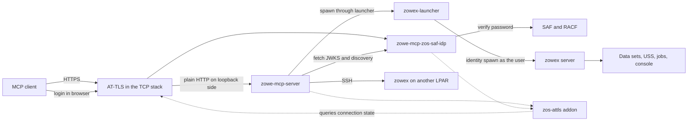
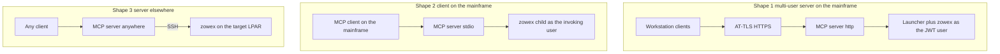
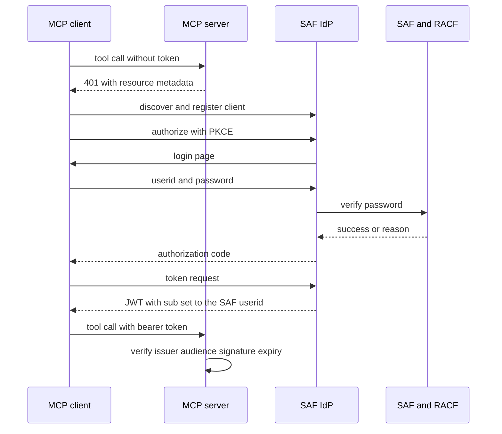
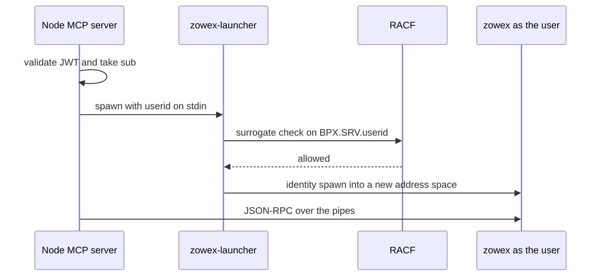
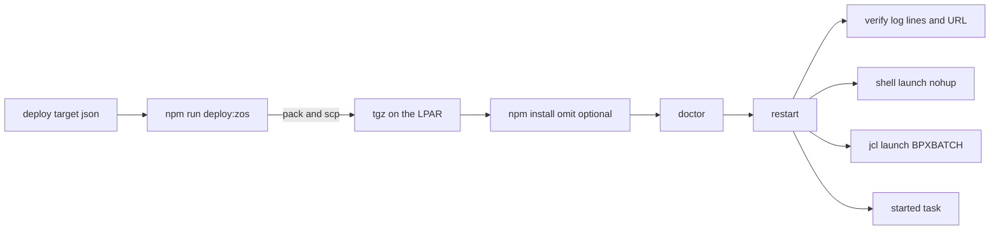

# Zowe MCP on z/OS: components, deployment shapes and operating guide

This is the front door to everything z/OS-specific in this repository. It is
for **contributors** (what each piece is, where the code lives, how the pieces
fit) and **deployers** (which shape to choose, what the LPAR needs, how to run
and troubleshoot it). Each section links to the detailed design or results
document; this page does not repeat them.

> **Security review.** Almost everything on the on-z/OS path touches
> authentication, credential handling, privilege switching or transport
> security: the SAF IdP, the identity-switch launcher, AT-TLS enforcement, the
> started-task identity. Those changes need a security/integrity specialist
> review before production-shaped use. The documents linked below say so
> individually; none of them asserts that the review has happened.

## 1. Two different ways to use z/OS from Zowe MCP

| | Server runs off z/OS (workstation, CI) | Server runs on z/OS |
| --- | --- | --- |
| What reaches z/OS | SSH to a `zowex` server process on the target LPAR | A `zowex` child process on the same LPAR, or SSH to another LPAR |
| Where you read about it | Main [README](../README.md), `docs/claude-code-mcp.md` | This page and the documents in section 9 |
| z/OS-side prerequisites | An SSH user, `zowex` (auto-deployed by the server) | Node.js for z/OS, plus the setup in sections 4 to 7 |

The first column is the everyday setup and needs nothing from this page. The
rest of this page is about the second column: running `@zowe/mcp-server`, and
optionally an OAuth server, **on** z/OS.

## 2. Components



| Component | What it is | Code and docs |
| --- | --- | --- |
| **MCP server** (`@zowe/mcp-server`) | The tool server. On z/OS it normally runs `--http` behind AT-TLS with a JWT bearer gate, and uses the `--native` backend. | `packages/zowe-mcp-server/` |
| **`zowex`** | The Zowe Remote SSH server (C++, from the zowex project). Speaks JSON-RPC on stdin and stdout and performs the actual z/OS operations. The SDK deploys it over SSH when it is missing or outdated. | `@zowe/zowex-for-zowe-sdk`, [`zos-local-zowex-identity.md`](./zos-local-zowex-identity.md) |
| **`LocalClient`** | The transport that runs `zowex server` as a local child instead of over SSH. Activated by a `local` systems entry plus an explicit operator assertion. | `src/zos/native/local-client.ts`, `local-system.ts` |
| **`zowex-launcher`** | A small program-controlled C program that switches identity to the authenticated user (SURROGAT authority) and runs `zowex`. The Node process itself never changes identity. | `packages/zowe-mcp-server/zos-launcher/` |
| **SAF IdP** (`zowe-mcp-zos-saf-idp`) | A dev/test OAuth 2.1 / OIDC authorization server that checks passwords against SAF. Section 5. | `packages/zowe-mcp-zos-saf-idp/`, [`zos-saf-idp.md`](./zos-saf-idp.md) |
| **`zos-attls`** | A query addon and fail-closed gate: asks the TCP stack whether each connection really is secured by AT-TLS, for inbound and outbound sockets. | `packages/zos-attls/`, [`zos-attls-aware-mode.md`](./zos-attls-aware-mode.md), [`zos-attls-client-mode.md`](./zos-attls-client-mode.md) |
| **Deploy script** | `npm run deploy:zos -- <target>`: packs a package, ships it over scp, installs it, runs the doctor, restarts the service and verifies it. | `scripts/deploy-zos.mjs`, [`deploy/README.md`](../deploy/README.md) |
| **Started tasks** | The services as STCs (`S ZMCPIDP`, `S ZMCPMCP`) under a dedicated, non-logon server userid. | [`zos-stc-launch.md`](./zos-stc-launch.md) |

Two principles run through the whole design:

- **The resource server stays authorization-server-free.** `@zowe/mcp-server`
  validates tokens from whatever IdP you point it at. The SAF IdP is a
  separate, opt-in package that the server never imports.
- **Fail closed.** AT-TLS, taken alone, fails open: if the policy agent is
  down or a rule is wrong, connections silently go out in cleartext. The
  `zos-attls` gate turns that into a refusal.

## 3. Deployment shapes



| # | Where the server runs | How z/OS work is reached | Identity used | Notes |
| --- | --- | --- | --- | --- |
| 1 | On z/OS, HTTP behind AT-TLS, JWT from an IdP | `local` system through the SURROGAT launcher | The token `sub`, per user | The multi-user shape. Needs operator and RACF work (section 6). Validated end to end on a live LPAR. |
| 2 | On z/OS, stdio, spawned by a z/OS-resident client | Direct `zowex server` child | The invoking user, inherited | No launcher, JWT or program control needed. **Not supported for multi-MB payloads** (storage limits, see section 4). |
| 3 | Anywhere, including a workstation | SSH to a different LPAR | The SSH credential's user | Unchanged. Also how a z/OS server reaches other LPARs. |
| not recommended | On z/OS, dialing itself over loopback SSH | SSH to 127.0.0.1 | One shared functional user | Deprecated fallback for sites that cannot get SURROGAT permits. |

Full reasoning, including why SURROGAT was chosen over PassTickets and SAF
IDTs: [`zos-local-zowex-identity.md`](./zos-local-zowex-identity.md).

## 4. Node.js on z/OS: what is different

The server is a normal Node 24 program, but IBM's port (IBM Open Enterprise
SDK for Node.js, `ibmruntimes/node-zos`) behaves differently from community
Node in ways that matter here. Measured results and the full plan:
[`zos-hosted-server-plan.md`](./zos-hosted-server-plan.md) and
[`zos-hosted-server-results.md`](./zos-hosted-server-results.md).

**Install and runtime**

- **Source.** The pax edition comes from IBM's download portal; it is not in
  corporate package repositories. Install with `pax -p p -r`, run `setup.sh`,
  and source the install's `.env` in every shell. A shared install with an
  `activate.sh` script is convenient.
- **Install location.** `/usr/lpp/IBM` is typically a read-only zFS. Use a
  writable shared directory for the Node install and the deployments.
- **Prerequisites.** ICSF active, at least 300 MB address space
  (`ulimit -A`), at least 2 GB above the bar (`ulimit -M`, MEMLIMIT), a `/tmp`
  of reasonable size or `TMPDIR` redirected. Check the required PTFs for your
  z/OS level in the IBM documentation.
- **LE runtime override.** If Node fails at startup with a missing-function
  error in a Language Environment DLL (`CEE3561S`), the base runtime library
  is back-level. The fix is to **add** a newer LE library via `STEPLIB`
  (for example an `...SCEERUN2.OVERRIDE` data set), not to unset it.
  Remember this for the PROGRAM class (section 5).
- **Not zIIP-eligible.** All Node CPU is general-purpose CPU. CPU seconds per
  tool call is the headline cost metric.
- **Install flags.** Install with `npm install --omit=optional`. The native
  SSH helpers (`russh`, `cpu-features`) have no z/OS build and are optional;
  the pure-JS `ssh2` path is what runs.

**Memory and WebAssembly**

- Node needs roughly 512 to 768 MB of above-bar storage just to run. With a
  2 GB MEMLIMIT the margin is thin.
- Under that limit an HTTP server doing JWKS fetches can die with
  `Fatal process out of memory: Zone` in a background WebAssembly compile.
  Start Node with `--no-wasm-tier-up --no-wasm-dynamic-tiering`
  (the deploy config field `nodeFlags` carries this).
  `--jitless` is **not** a workaround: it removes `WebAssembly`, and `ssh2`
  references it unconditionally at load time.

**Encoding and files**

- Untagged files are treated as EBCDIC unless `__UNTAGGED_READ_MODE` says
  otherwise. Files copied in by SFTP or `pax` need `chtag -tc 819` (text) or
  `chtag -b` (binary).
- stdio defaults to CCSID 1047. On the sessions tested, a stdio `initialize`
  came out as clean ASCII JSON without extra variables; if yours does not, set
  `NODE_STDIN_CCSID`, `NODE_STDOUT_CCSID` and `NODE_STDERR_CCSID` to 819.
  Sockets (the HTTP shape) are unaffected.
- **`fs.readFileSync` can corrupt file bytes** on the tested Node 24 build,
  regardless of file tag or `_BPXK_AUTOCVT`: each ASCII byte comes back
  substituted by its EBCDIC-codepoint equivalent. Treat any file the server
  reads from disk on z/OS as suspect. This is also why the IdP generates keys
  in memory and never reads a key file.

**Process hygiene**

- Each killed z/OS node process can leak message queues (epoll emulation).
  The deploy script defaults `__IPC_CLEANUP=1` for this. Hitting the system
  `IPCMSGNIDS` cap stops every new node on the LPAR from starting.
- `ps -ef` truncates long command lines, so keep `stopPattern` short.
  `pcpu` is always blank; use `atime` deltas or SMF 30 for CPU.
- The Node built-in `--prof` profiler does not work. Use in-process counters,
  SMF 30 and `_BPX_JOBNAME` (the deploy contract sets `ZMCPSRV`) to attribute
  CPU.

**Environment contract.** On z/OS a process inherits wildly different
environments depending on how it was started (BPXBATCH, login shell, cron,
non-interactive ssh). Deployments therefore declare **exactly** the variables
the runtime relies on (`runtimeEnv`) and inherit everything else untouched.
See [`deploy/README.md`](../deploy/README.md).

## 5. The SAF IdP for testing

`zowe-mcp-zos-saf-idp` lets you test the **full MCP OAuth flow (including VS
Code) with nothing installed outside z/OS** except the client. It
authenticates users against the LPAR's own security manager and issues JWTs
that `@zowe/mcp-server` accepts unchanged.

> **Dev and test only.** The product policy is that Zowe MCP does not embed an
> authorization server ([`mcp-authentication-oauth.md`](./mcp-authentication-oauth.md)).
> The IdP is a separate package for testing; production deployments bring
> their own IdP. Keys and clients live in memory and a restart invalidates
> every token.



**What it provides:** OAuth 2.1 authorization code with PKCE, OIDC and RFC 8414
discovery, dynamic client registration behind a redirect allowlist, refresh
token rotation, RS256 access tokens bound to the MCP server (`aud`), and `sub`
set to the canonical **uppercase SAF userid**.

**Two password-check backends** (`--saf-check`, default `auto`):

- **native**: the z/OS `__passwd()` service through IBM's `node-racf` addon.
  Distinguishes expired passwords, and works when sshd forbids password logins.
- **ssh**: a connect-only SSH probe, portable but a binary verdict.

**Native backend requirements (the hard part).** When `BPX.DAEMON` is defined
(almost always), every module loaded into the calling address space must be
**program-controlled**, otherwise `__passwd` fails with `EMVSERR` and reason
`JRENVDIRTY`:

1. `extattr +p` on the `node` binary, its shared libraries and the addon
   (needs READ on `BPX.FILEATTR.PROGCTL`).
2. Any **data set** the runtime loads from, including an LE `STEPLIB`
   override, must be covered by the RACF **PROGRAM** class. This is the
   non-obvious one: marking USS files is not enough.
3. `node-racf` needs a build fix for Node 24 (`node-addon-api` 8.x, Open XL
   C/C++). Details in the SAF IdP document.

**Run the checks before testing:**

```sh
zowe-mcp-zos-saf-idp doctor          # environment checks, prints the RACF commands to run
zowe-mcp-zos-saf-idp doctor --fix    # applies only the USS extattr +p step, if you are allowed to
```

`--fix` never runs RACF changes; the doctor prints the exact commands for an
administrator instead. Hardening you get by default includes mandatory audience, upstream timeouts,
login rate budget, DCR limits and generic errors that do not reveal whether a
userid exists. What it deliberately does not do is covered in the document's
"Scope and non-goals" and "Before running this anywhere beyond a developer's
own test session" sections.

Full reference: [`zos-saf-idp.md`](./zos-saf-idp.md) and the package
[README](../packages/zowe-mcp-zos-saf-idp/README.md).

## 6. Securing the transport and switching identity

### AT-TLS and the fail-closed gate

On z/OS the HTTP services listen on plain HTTP and a Policy Agent rule wraps
connections in TLS (AT-TLS). Two things are configured together:

- **AT-TLS policy** for the port: inbound for the servers, outbound for the
  MCP server's calls to the IdP. Without ICSF, TLS 1.3 is unavailable; pin
  TLS 1.2 with RSA key-exchange suites. Pin the server name on outbound rules
  (`HostReferenceIdDNS`) or the client accepts any certificate the policy
  trusts.
- **Aware mode** in the services, so that a connection the stack did not
  secure is rejected.

| Setting | Values | Meaning |
| --- | --- | --- |
| `ZOWE_MCP_ATTLS` (inbound, MCP server) and `--attls` (IdP) | off, monitor, required | `monitor` logs would-be rejections, `required` enforces. Roll out with `monitor` first. |
| `ZOWE_MCP_ATTLS_CLIENT` (outbound) | off, monitor, required | Same modes for the JWKS and discovery fetches. |
| `ZOWE_MCP_ATTLS_LOOPBACK_CLEAR` | reject (default), allow | Opt-in exemption for loopback cleartext, for hosts whose policy deliberately keeps it. |
| `ZOWE_MCP_ATTLS_MODULE` | path | Location of the built `zos-attls` addon. |
| `--tls-terminated` (IdP) | flag | The operator's assertion that AT-TLS covers the port. Aware mode is its enforcement. |

Use `expectLog` in the deploy target to make a deployment fail unless the
startup log contains the expected mode lines. The mechanism is a query-only
`SIOCTTLSCTL` ioctl (no special authority, no program control needed).
Details and verdict table: [`zos-attls-aware-mode.md`](./zos-attls-aware-mode.md);
outbound side: [`zos-attls-client-mode.md`](./zos-attls-client-mode.md).

### Identity switching for shape 1

The MCP server runs as one server identity and never holds daemon authority.
For each user, the launcher does the switch.



Key facts:

- **Authority is SURROGAT**: the server identity needs READ on
  `BPX.SRV.<userid>` in the SURROGAT class for every user it may act for. No
  password, PassTicket or token crosses into the launcher.
- **Identity spawn, not `setuid` plus `exec`.** Live validation showed that a
  surrogate `setuid()` changes the MVS identity but leaves the **POSIX
  supplementary group list** of the invoker, which carried real file
  authority. An identity spawn builds the child under the target's complete
  security environment; a regression test keeps this proven.
- The launcher refuses UID 0, validates the userid shape, reads it from stdin
  (never argv or environment) and uses distinct exit codes with remediation
  hints.
- **Operator assertion.** The `local` system is only active when
  `ZOWE_MCP_LOCAL_SUB_IS_USERID=1` states that the token issuer authenticates
  against this system's SAF. Also set `ZOWE_MCP_LOCAL_LAUNCHER` and
  `ZOWE_MCP_LOCAL_ZOWEX` (one shared zowex binary every permitted user can
  execute).
- Check a host with `zowe-mcp-server doctor-local`.

Per-user connections persist through `ZOWE_MCP_TENANT_STORE_DIR` (optionally
encrypted at rest with `ZOWE_MCP_TENANT_STORE_KEY`).

References: [`zos-local-zowex-identity.md`](./zos-local-zowex-identity.md) and
the launcher [README](../packages/zowe-mcp-server/zos-launcher/README.md).

## 7. Deploying



1. **Prepare the host once**: Node install, program control for the IdP's
   native backend, RACF profiles (server userid, shared group, STARTED
   profiles, SURROGAT permits, keyring access), the AT-TLS policy, and the
   built `zos-attls` addon and launcher. Most of this is RACF and Policy Agent
   work for a human with authority.
2. **Describe the target** in `deploy/<target>.json` (gitignored: real targets
   carry internal hostnames and userids). Start from
   `deploy/example-idp.json`. Secrets go in `deploy/.env` and are referenced
   with `${ENV:NAME}`, never written into the JSON.
3. **Deploy**: `npm run deploy:zos -- <target>`. Flags: `--skip-pack`,
   `--no-restart`, `--launch=shell|jcl`.
4. **Choose a launch mode**:

| Mode | How it runs | When to use |
| --- | --- | --- |
| `shell` | `nohup` background process over ssh | Quick iteration. |
| `jcl` | Generated BPXBATCH batch job, same pidfile and env-file contract | When a batch job is acceptable. Old jobs keep held output (`MSGCLASS=X`); purge occasionally. |
| started task | `S ZMCPIDP` and `S ZMCPMCP` under a dedicated no-logon userid in a shared group | The operational shape: START and STOP, no JES initiator held, server identity is not a personal admin ID. |

The three modes share the stop and verify machinery, so they are
interchangeable. **Stopping is a kill of the pid**, not `P`, because
BPXBATCH waits on its child. Details, the RACF command batch (left for a human
to approve and run) and the cutover findings:
[`zos-stc-launch.md`](./zos-stc-launch.md).

Two z/OS specifics the JCL generator is built around: BPXBATCH starts a login
shell, so `STDENV` is overridden by `/etc/profile`; the generated command
sources the env file inside `STDPARM` instead. `STDPARM` records are 80 columns
and concatenated with blanks, so no single token may exceed one record.

## 8. Troubleshooting quick reference

| Symptom | Likely cause | Where to look |
| --- | --- | --- |
| Node dies at startup with `CEE3561S` in a runtime DLL | Back-level LE library | Add the override library via `STEPLIB` (section 4) |
| `__passwd` fails with `EMVSERR` or `JRENVDIRTY` | Address space not program-controlled | `extattr +p` list and the PROGRAM class for every loaded data set (section 5); run the IdP `doctor` |
| `Fatal process out of memory: Zone` after a clean start | MEMLIMIT too low for WebAssembly compile | `--no-wasm-tier-up --no-wasm-dynamic-tiering` (section 4) |
| Keys or config files read as garbage | `fs.readFileSync` byte corruption | Avoid on-disk reads of sensitive input (section 4) |
| New node processes will not start anywhere on the LPAR | IPC message queue leak | `__IPC_CLEANUP=1`, raise `IPCMSGNIDS` |
| Every TLS handshake is reset after moving to an STC userid | The server userid cannot read the keyring | R_datalib (RDATALIB) profile access for the new identity ([`zos-stc-launch.md`](./zos-stc-launch.md)) |
| Connections rejected in `required` mode | AT-TLS rule missing or Policy Agent down | The startup log mode lines; run in `monitor` first |
| Local mode refuses to start | Assertion or paths missing | `zowe-mcp-server doctor-local` |
| A multi-MB `readDataset` kills the stdio server on z/OS | Storage limits (shape 2) | Use shape 1, or cap payload sizes |
| Deploy stop leaves the old process | Pidfile overwritten by a duplicate start | [`zos-stc-launch.md`](./zos-stc-launch.md), stop semantics |

## 9. Where to read next

| If you want to | Read |
| --- | --- |
| Understand the on-z/OS plan, Node facts and measurements | [`zos-hosted-server-plan.md`](./zos-hosted-server-plan.md), [`zos-hosted-server-results.md`](./zos-hosted-server-results.md) |
| Run or extend the SAF IdP | [`zos-saf-idp.md`](./zos-saf-idp.md) |
| Understand the identity switch and deployment shapes | [`zos-local-zowex-identity.md`](./zos-local-zowex-identity.md), [launcher README](../packages/zowe-mcp-server/zos-launcher/README.md) |
| Enforce AT-TLS | [`zos-attls-aware-mode.md`](./zos-attls-aware-mode.md), [`zos-attls-client-mode.md`](./zos-attls-client-mode.md), [`packages/zos-attls`](../packages/zos-attls/README.md) |
| Deploy and operate | [`deploy/README.md`](../deploy/README.md), [`zos-stc-launch.md`](./zos-stc-launch.md) |
| Plan identity mapping beyond SAF userids | [`future-zos-identity-mapping.md`](./future-zos-identity-mapping.md) |
| Understand OAuth policy and clients | [`mcp-authentication-oauth.md`](./mcp-authentication-oauth.md) |
| Develop without a mainframe | [`mock-zos-host.md`](./mock-zos-host.md) |
| Record observations from agent sessions | [`agent-feedback.md`](./agent-feedback.md) |
