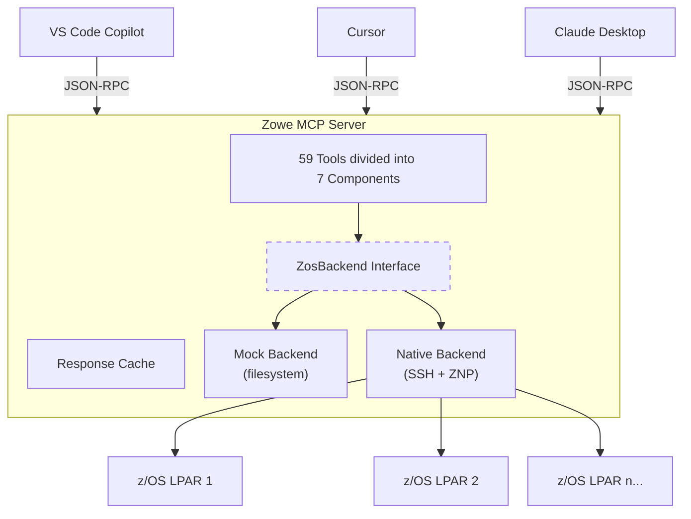
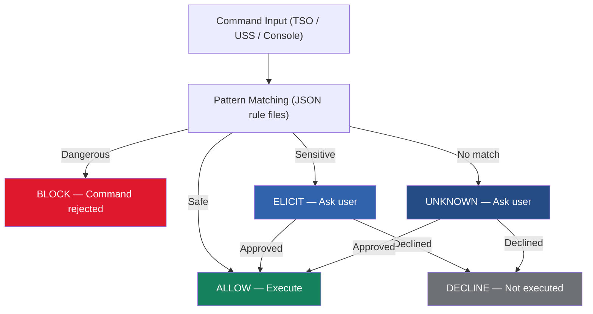
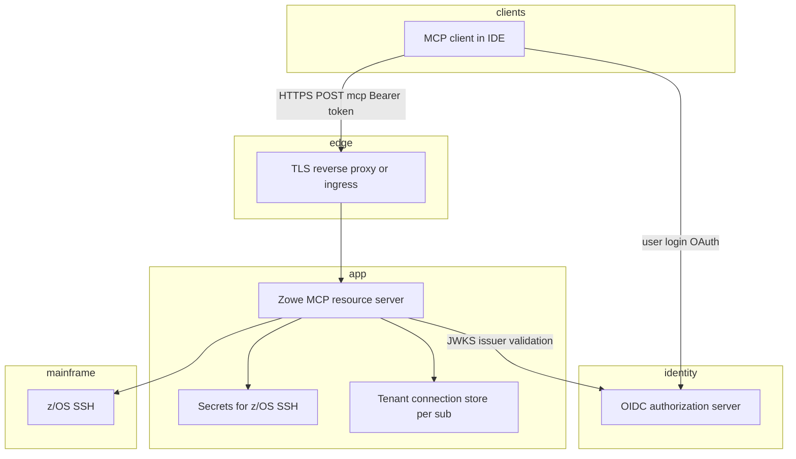

<!-- Last reviewed: 2026-04 — End-of-deck slides: shared HTTP OAuth topology, MCP registries; docs/remote-http-mcp-registry.md. CLI Bridge: docs/how-to-add-cli-plugin.md -->

<!-- Slide 1: Title -->

<div class="flex flex-col items-center justify-center h-full">
  
  <h1 class="!text-5xl !font-extrabold !text-white !border-none !mb-4">Zowe MCP</h1>
  <p class="text-2xl !text-white/90 font-light">AI-Powered z/OS Access via Model Context Protocol</p>
  <p class="text-sm !text-white/50 mt-6">Last updated: April 2026</p>
</div>

<style>
.slidev-layout {
  background: linear-gradient(135deg, #1b375f 0%, #3162ac 60%, #3975d0 100%);
}
</style>

---

<!-- markdownlint-disable MD001 MD024 MD025 MD060 -->

<!-- Slide 2: What is MCP? -->

# What is MCP?

**Model Context Protocol** is an open standard (by Anthropic) that connects AI assistants to external tools and data sources.

<div class="grid grid-cols-2 gap-8 mt-6">
<div>

### <carbon-warning-alt class="inline text-[#e0182d]" /> The Problem

- LLMs are powerful but **isolated** from real systems
- Copy-pasting data into chat is slow and error-prone
- No structured way for AI to **act** on your behalf

</div>
<div>

### <carbon-checkmark-filled class="inline text-[#16825d]" /> The Solution

- **Standardized protocol** for tool discovery and invocation
- AI reads tool schemas, decides which to call, interprets results
- Adopted by **VS Code Copilot**, **Cursor**, **Claude Desktop**, **JetBrains**, and more

</div>
</div>

<div class="mt-6 p-4 bg-[#f3f4f4] rounded-lg border border-[#dddee0]">
  <strong class="text-[#1b375f]">Key insight:</strong> Zowe MCP lets AI assistants use z/OS tools the same way they use any other tool — and enable the use of z/OS like they can do with other systems.
</div>

---

<!-- Slide 3: What is Zowe MCP? -->

# What is Zowe MCP?

An **MCP server** and **VS Code extension** that gives AI assistants direct, structured access to z/OS systems and mainframe resources, such as data sets, jobs, and USS files, and do actions with them.

<div class="mt-3 p-3 bg-[#eef2f8] rounded-lg border-l-4 border-[#3975d0] text-sm">
  <carbon-machine-learning class="inline text-[#3162ac]" /> <strong class="text-[#1b375f]">Built with AI:</strong> Not a single line of Zowe MCP was written manually — every line was coded with <strong>frontier AI models in VS Code</strong>, guided and reviewed by architects at Broadcom with experience building MCP servers and AI applications and strong mainframe background.
</div>

<div class="grid grid-cols-4 gap-4 mt-8">
  <div class="text-center p-4 bg-[#f3f4f4] rounded-lg border-t-4 border-[#3162ac]">
    <carbon-assembly-cluster class="text-2xl text-[#3162ac] mb-1" />
    <div class="text-4xl font-extrabold text-[#3162ac]">7</div>
    <div class="text-sm text-[#6d7176] mt-1">Components</div>
  </div>
  <div class="text-center p-4 bg-[#f3f4f4] rounded-lg border-t-4 border-[#3162ac]">
    <carbon-tool-box class="text-2xl text-[#3162ac] mb-1" />
    <div class="text-4xl font-extrabold text-[#3162ac]">59</div>
    <div class="text-sm text-[#6d7176] mt-1">Tools</div>
  </div>
  <div class="text-center p-4 bg-[#f3f4f4] rounded-lg border-t-4 border-[#3162ac]">
    <carbon-chat class="text-2xl text-[#3162ac] mb-1" />
    <div class="text-4xl font-extrabold text-[#3162ac]">4</div>
    <div class="text-sm text-[#6d7176] mt-1">Prompts</div>
  </div>
  <div class="text-center p-4 bg-[#f3f4f4] rounded-lg border-t-4 border-[#3162ac]">
    <carbon-document class="text-2xl text-[#3162ac] mb-1" />
    <div class="text-4xl font-extrabold text-[#3162ac]">2</div>
    <div class="text-sm text-[#6d7176] mt-1">Resource Templates</div>
  </div>
</div>

<div class="mt-8 grid grid-cols-3 gap-4 text-sm">
  <div class="p-3 bg-[#f3f4f4] rounded-lg border-l-4 border-[#16825d]">
    <div class="font-bold text-[#1b375f] mb-1"><carbon-terminal class="inline text-[#16825d]" /> Standalone Server</div>
    <div class="text-[#6d7176]"><code>npx @zowe/mcp-server --stdio</code> — works with any MCP client</div>
  </div>
  <div class="p-3 bg-[#f3f4f4] rounded-lg border-l-4 border-[#16825d]">
    <div class="font-bold text-[#1b375f] mb-1"><mdi-microsoft-visual-studio-code class="inline text-[#16825d]" /> VS Code Extension</div>
    <div class="text-[#6d7176]">Extension registers an Zowe MCP server as a <strong>local stdio server</strong> — used by Copilot Chat and Cursor automatically</div>
  </div>
  <div class="p-3 bg-[#f3f4f4] rounded-lg border-l-4 border-[#16825d]">
    <div class="font-bold text-[#1b375f] mb-1"><carbon-cloud class="inline text-[#16825d]" /> Remote HTTP Streamable</div>
    <div class="text-[#6d7176]"><strong>Shared</strong> team server — HTTPS <code>/mcp</code>, optional Bearer JWT, MCP registry <code>remotes</code>. Covered at the <strong>end of this deck</strong>.</div>
  </div>
</div>

---

<!-- Slide 4: Use Cases -->

# Use Cases <span class="text-sm font-normal text-[#6d7176]">— <a href="https://github.com/plavjanik/zowe-mcp/blob/main/docs/use-cases.md" target="_blank">detailed workflows</a></span>

<div class="grid grid-cols-2 gap-5 mt-4">
  <div class="p-4 bg-[#f3f4f4] rounded-lg border-l-4 border-[#3162ac]">
    <div class="font-bold text-[#1b375f] mb-1"><carbon-education class="inline text-[#3162ac]" /> Mainframe Onboarding</div>
    <div class="text-sm text-[#6d7176]">New developers explore z/OS data sets, JCL, and COBOL through natural language — no ISPF knowledge needed.</div>
  </div>
  <div class="p-4 bg-[#f3f4f4] rounded-lg border-l-4 border-[#3162ac]">
    <div class="font-bold text-[#1b375f] mb-1"><carbon-code class="inline text-[#3162ac]" /> AI-Assisted COBOL Development</div>
    <div class="text-sm text-[#6d7176]">Search source, read copybooks, compile, submit jobs, and review output — all from Copilot Chat.</div>
  </div>
  <div class="p-4 bg-[#f3f4f4] rounded-lg border-l-4 border-[#3162ac]">
    <div class="font-bold text-[#1b375f] mb-1"><carbon-batch-job class="inline text-[#3162ac]" /> Batch Job Automation</div>
    <div class="text-sm text-[#6d7176]">Submit JCL, wait for completion, check return codes, search spool output — driven by AI agents.</div>
  </div>
  <div class="p-4 bg-[#f3f4f4] rounded-lg border-l-4 border-[#3162ac]">
    <div class="font-bold text-[#1b375f] mb-1"><carbon-connect class="inline text-[#3162ac]" /> Cross-Platform Workflows</div>
    <div class="text-sm text-[#6d7176]">AI reads z/OS data, transforms it, writes results — bridging mainframe and distributed systems.</div>
  </div>
  <div class="p-4 bg-[#f3f4f4] rounded-lg border-l-4 border-[#3162ac]">
    <div class="font-bold text-[#1b375f] mb-1"><carbon-search class="inline text-[#3162ac]" /> Code Review & Analysis</div>
    <div class="text-sm text-[#6d7176]">MCP prompts let AI review JCL, explain data sets, and compare PDS members with structured context.</div>
  </div>
  <div class="p-4 bg-[#f3f4f4] rounded-lg border-l-4 border-[#3162ac]">
    <div class="font-bold text-[#1b375f] mb-1"><carbon-terminal class="inline text-[#3162ac]" /> System Administration</div>
    <div class="text-sm text-[#6d7176]">Run TSO and USS commands with safety guardrails, manage multiple z/OS systems from one chat.</div>
  </div>
</div>

---

<!-- Slide 5: Demo -->

# Demo

<div class="flex flex-col items-center justify-center h-[70%]">
  <carbon-screen class="text-6xl text-[#3162ac] mb-6" />
  <h2 class="!text-3xl !text-[#3162ac] !border-none">Live Demo</h2>
  <p class="text-lg text-[#6d7176] mt-4 text-center max-w-lg">
    Using GitHub Copilot Chat with Zowe MCP to explore data sets,
    submit jobs, and search COBOL source on z/OS
  </p>
  <div class="mt-8 grid grid-cols-3 gap-6 text-center text-sm">
    <div class="p-3 bg-[#f3f4f4] rounded-lg">
      <carbon-data-base class="inline text-[#3162ac]" /> <strong class="text-[#1b375f]">1.</strong> List data sets
    </div>
    <div class="p-3 bg-[#f3f4f4] rounded-lg">
      <carbon-search class="inline text-[#3162ac]" /> <strong class="text-[#1b375f]">2.</strong> Search COBOL source
    </div>
    <div class="p-3 bg-[#f3f4f4] rounded-lg">
      <carbon-task class="inline text-[#3162ac]" /> <strong class="text-[#1b375f]">3.</strong> Submit &amp; monitor job
    </div>
  </div>
</div>

---

<!-- Slide 6: Section — Architecture -->

<div class="flex flex-col items-center justify-center h-full">
  <carbon-network-3 class="text-5xl text-[#3975d0] mb-4" />
  <div class="text-6xl font-extrabold text-[#3162ac] mb-4">Architecture</div>
  <div class="text-xl text-[#6d7176]">How Zowe MCP connects AI to z/OS</div>
  <div class="mt-8 w-24 h-1 bg-gradient-to-r from-[#1b375f] via-[#3162ac] to-[#3975d0] rounded-full"></div>
</div>

<style>
.slidev-layout {
  background: #f3f4f4;
}
</style>

---

<!-- Slide 6: Architecture Overview -->

# Architecture Overview



---

<!-- Slide 7: Component Map -->

# Tool Components

<div class="grid grid-cols-4 gap-3 mt-4">
  <div class="col-span-4 text-center p-3 bg-[#1b375f] text-white rounded-lg font-bold text-lg">
    Zowe MCP Server — 59 tools
  </div>
  <div class="p-3 bg-[#f3f4f4] rounded-lg border-t-3 border-[#3162ac] text-center">
    <carbon-data-base class="text-xl text-[#3162ac]" />
    <div class="font-bold text-[#1b375f]">datasets</div>
    <div class="text-2xl font-extrabold text-[#3162ac]">15</div>
    <div class="text-xs text-[#6d7176] mt-1">list · read · write · search<br/>create · delete · copy · rename</div>
  </div>
  <div class="p-3 bg-[#f3f4f4] rounded-lg border-t-3 border-[#3162ac] text-center">
    <carbon-folder class="text-xl text-[#3162ac]" />
    <div class="font-bold text-[#1b375f]">uss</div>
    <div class="text-2xl font-extrabold text-[#3162ac]">17</div>
    <div class="text-xs text-[#6d7176] mt-1">list · read · write · command<br/>chmod · chown · chtag · copy</div>
  </div>
  <div class="p-3 bg-[#f3f4f4] rounded-lg border-t-3 border-[#3162ac] text-center">
    <carbon-task class="text-xl text-[#3162ac]" />
    <div class="font-bold text-[#1b375f]">jobs</div>
    <div class="text-2xl font-extrabold text-[#3162ac]">15</div>
    <div class="text-xs text-[#6d7176] mt-1">submit · status · output<br/>cancel · hold · release · delete</div>
  </div>
  <div class="p-3 bg-[#f3f4f4] rounded-lg border-t-3 border-[#3162ac] text-center">
    <carbon-settings class="text-xl text-[#3162ac]" />
    <div class="font-bold text-[#1b375f]">context</div>
    <div class="text-2xl font-extrabold text-[#3162ac]">3</div>
    <div class="text-xs text-[#6d7176] mt-1">listSystems · setSystem<br/>getContext</div>
  </div>
</div>

<div class="grid grid-cols-3 gap-3 mt-3">
  <div class="p-3 bg-[#f3f4f4] rounded-lg border-t-3 border-[#3975d0] text-center">
    <carbon-application class="text-xl text-[#3975d0]" />
    <div class="font-bold text-[#1b375f]">zowe-explorer</div>
    <div class="text-xl font-extrabold text-[#3975d0]">3</div>
    <div class="text-xs text-[#6d7176]">open dataset · USS file · job in editor</div>
  </div>
  <div class="p-3 bg-[#f3f4f4] rounded-lg border-t-3 border-[#3975d0] text-center">
    <carbon-terminal class="text-xl text-[#3975d0]" />
    <div class="font-bold text-[#1b375f]">tso</div>
    <div class="text-xl font-extrabold text-[#3975d0]">1</div>
    <div class="text-xs text-[#6d7176]">runSafeTsoCommand</div>
  </div>
  <div class="p-3 bg-[#f3f4f4] rounded-lg border-t-3 border-[#3975d0] text-center">
    <carbon-document-export class="text-xl text-[#3975d0]" />
    <div class="font-bold text-[#1b375f]">local-files</div>
    <div class="text-xl font-extrabold text-[#3975d0]">5</div>
    <div class="text-xs text-[#6d7176]">download · upload · dataset · USS · job</div>
  </div>
</div>

---

<!-- Slide 8: Zowe Native Proto -->

# Zowe Native Proto (ZNP)

The native backend connects to z/OS through **Zowe Native Proto** — a lightweight z/OS server deployed over SSH.

<div class="grid grid-cols-2 gap-6 mt-4">
<div>

### <carbon-rocket class="inline text-[#3162ac]" /> Why ZNP?

- <carbon-locked class="inline text-[#6d7176]" /> **Only SSH required** — no z/OSMF, no APIML, no special middleware
- <carbon-deploy class="inline text-[#6d7176]" /> **Auto-deploy** — the MCP server installs and updates the ZNP binary on z/OS automatically
- <carbon-renew class="inline text-[#6d7176]" /> **Auto-redeploy** — detects version mismatch and redeploys on the fly
- <carbon-plug class="inline text-[#6d7176]" /> **Extensible by anyone** — open source, new operations can be added to the SDK
- <carbon-flash class="inline text-[#6d7176]" /> **Lightweight** — small native binary, minimal z/OS footprint

</div>
<div>

### <carbon-flow class="inline text-[#3162ac]" /> How It Works

1. MCP server opens an **SSH connection** to z/OS
2. ZNP binary is **deployed to user's USS home** (if needed)
3. Commands are sent as **structured RPC** over the SSH channel
4. Results come back as **JSON** — parsed and cached by the MCP server

### Key Operations via ZNP

- Data set list, read, write, search (SuperC)
- USS file operations and commands
- TSO command execution
- Job submission and management

</div>
</div>

---

<!-- Slide 9: VS Code Extension Integration -->

# <mdi-microsoft-visual-studio-code class="inline text-[#3162ac]" /> VS Code Extension Integration

<div class="grid grid-cols-2 gap-6">
<div>

### <carbon-two-person-lift class="inline text-[#3162ac]" /> Dual Registration

- **VS Code** — `mcpServerDefinitionProviders` API
- **Cursor** — `vscode.cursor.mcp.registerServer()`
- Works in both IDEs from a single extension

### <carbon-connection-signal class="inline text-[#3162ac]" /> Named Pipe Communication

An **additional channel** alongside stdio for deeper VS Code integration

- Bidirectional NDJSON over Unix socket
- Real-time log level changes
- Password collection via extension UI
- Zowe Explorer open-in-editor events

</div>
<div>

### <carbon-star class="inline text-[#3162ac]" /> Extension Features

- **Mock data generation** — palette command to init mock data
- **Settings-driven** — connections, encoding, log level, job cards
  - Automatically updates the server configuration

</div>
</div>

---

<!-- Slide 10: Section — Capabilities -->

<div class="flex flex-col items-center justify-center h-full">
  <carbon-tool-box class="text-5xl text-[#3975d0] mb-4" />
  <div class="text-6xl font-extrabold text-[#3162ac] mb-4">Capabilities</div>
  <div class="text-xl text-[#6d7176]">What can AI do with z/OS through Zowe MCP?</div>
  <div class="mt-8 w-24 h-1 bg-gradient-to-r from-[#1b375f] via-[#3162ac] to-[#3975d0] rounded-full"></div>
</div>

<style>
.slidev-layout {
  background: #f3f4f4;
}
</style>

---

<!-- Slide 11: Data Set Operations -->

# <carbon-data-base class="inline text-[#3162ac]" /> Data Set Operations — 15 Tools

<div class="grid grid-cols-2 gap-6">
<div>

### <carbon-list class="inline text-[#3162ac]" /> CRUD

- **listDatasets** — ISPF 3.4 style pattern matching
- **listMembers** — PDS or PDS/E member listing
- **readDataset** — line-windowed reads
- **writeDataset** — full or block-of-records
- **createDataset** / **createTempDataset**
- **deleteDataset** / **deleteDatasetsUnderPrefix**
- **copyDataset** / **renameDataset**
- **restoreDataset** — HSM recall

</div>
<div>

### <carbon-search class="inline text-[#3162ac]" /> Search & Attributes

- **searchInDataset** — SuperC search, context lines, COBOL-aware
- **getDatasetAttributes** — dsorg, recfm, lrecl, SMS classes, dates

### <carbon-flash class="inline text-[#3162ac]" /> Smart Features

- **Pagination** — offset/limit with `hasMore`
- **Response cache** — LRU, 10 min TTL
- **EBCDIC encoding** — IBM-037 default, per-system overrides
- **Temp data sets** — prefix generation + cleanup

</div>
</div>

---

<!-- Slide 12: USS Operations -->

# <carbon-folder class="inline text-[#3162ac]" /> USS Operations — 17 Tools

<div class="grid grid-cols-2 gap-6">
<div>

### <carbon-folder-open class="inline text-[#3162ac]" /> File System

- **listUssFiles** — directory listing with metadata
- **readUssFile** / **writeUssFile** — line-windowed reads
- **createUssFile** — files and directories
- **deleteUssFile** — with recursive support
- **copyUssFile** — recursive, symlink-aware
- **chmod** / **chown** / **chtag** — permissions, ownership, encoding tags

</div>
<div>

### <carbon-terminal class="inline text-[#3162ac]" /> Commands & Temp Files

- **runSafeUssCommand** — execute Unix commands with safety patterns
- **getUssHome** — resolve user home directory
- **changeUssDirectory** — per-system working directory
- **Temp operations** — getUssTempDir, getUssTempPath, createTempUssDir, createTempUssFile, deleteUssTempUnderDir

### <carbon-direction-fork class="inline text-[#3162ac]" /> Path Resolution

- Absolute (`/u/user/...`) or relative to current working directory
- Display paths shown relative when under cwd

</div>
</div>

---

<!-- Slide 13: Jobs -->

# <carbon-task class="inline text-[#3162ac]" /> Job Operations — 15 Tools

<div class="grid grid-cols-2 gap-6">
<div>

### <carbon-play class="inline text-[#3162ac]" /> Submit & Monitor

- **submitJob** — inline JCL with optional `wait: true` (adaptive polling)
- **submitJobFromDataset** — submit from PDS member
- **submitJobFromUss** — submit from USS file
- **getJobStatus** — INPUT / ACTIVE / OUTPUT + return code
- **listJobs** — filter by owner, prefix, status

</div>
<div>

### <carbon-document class="inline text-[#3162ac]" /> Output & Lifecycle

- **listJobFiles** — spool file listing
- **readJobFile** — line-windowed spool reads
- **getJobOutput** — aggregated output across files
- **searchJobOutput** — substring search in spool
- **getJcl** — retrieve submitted JCL
- **cancelJob** / **holdJob** / **releaseJob** / **deleteJob**

### <carbon-receipt class="inline text-[#3162ac]" /> Job Cards

- Auto-prepended when JCL lacks a JOB statement
- Configurable per connection (VS Code setting or config file)

</div>
</div>

---

<!-- Slide 14: TSO Commands -->

# <carbon-security class="inline text-[#3162ac]" /> TSO & Command Safety

<div class="grid grid-cols-2 gap-6">
<div>

### runSafeTsoCommand

Issue TSO commands with **pattern-based safety**:

| Category | Action | Examples |
|----------|--------|----------|
| **Dangerous** | Block | DELETE SYS1.*, PASSWORD, OSHELL |
| **Sensitive** | Elicit user | DELETE own DS, SUBMIT |
| **Safe** | Allow | LISTDS, STATUS, TIME, WHO |
| **Unknown** | Elicit user | Anything not matched |

</div>
<div>

### runSafeUssCommand

Same safety model for Unix commands:

| Category | Examples |
|----------|----------|
| **Dangerous** | `rm -rf /`, `mkfs`, `shutdown` |
| **Sensitive** | `rm`, `mv`, `chmod 777` |
| **Safe** | `ls`, `cat`, `grep`, `find` |

### How Elicitation Works

When a command needs approval, the server asks the MCP client to prompt the user — the AI cannot bypass this.

</div>
</div>

---

<!-- Slide 15: Multi-System Support -->

# <carbon-network-3 class="inline text-[#3162ac]" /> Multi-System Support

<div class="grid grid-cols-2 gap-6">
<div>

### <carbon-server-proxy class="inline text-[#3162ac]" /> System Management

- **listSystems** — show all configured z/OS systems
- **setSystem** — switch active system (by host or user@host)
- **getContext** — current system, user, working directory

### <carbon-connect class="inline text-[#3162ac]" /> Connection Model

- One **system** = one z/OS host
- Multiple **connections** per host (different users)
- `system` parameter on every tool — explicit or use active

</div>
<div>

### <carbon-magic-wand class="inline text-[#3162ac]" /> Smart Defaults

- **Single system** — auto-activated, no `setSystem` needed
- **Lazy initialization** — context created on first tool call
- **Per-system state** — each system remembers its user, USS cwd, encoding overrides

### <carbon-settings class="inline text-[#3162ac]" /> Configuration

- **VS Code** — `zoweMCP.nativeConnections` setting
- **Standalone** — `--config systems.json` or `--system user@host`
- **Mock** — `systems.json` in mock data directory

</div>
</div>

---

<!-- Slide 16: AI-Native Features -->

# <carbon-machine-learning class="inline text-[#3162ac]" /> AI-Native Design

Features that make Zowe MCP work **better with LLMs** than traditional APIs:

<div class="grid grid-cols-2 gap-6 mt-4">
<div>

### <carbon-data-structured class="inline text-[#3162ac]" /> Structured Output

- **Output schemas** (Zod) on every tool — clients validate `structuredContent`
- **Response envelope** — `_context` (resolution metadata), `_result` (pagination), `data` (payload)
- **Tool annotations** — `readOnlyHint` skips VS Code confirmation, `destructiveHint` warns

### <carbon-page-first class="inline text-[#3162ac]" /> Pagination Protocol

- **List pagination** — offset/limit with `hasMore` and directive messages
- **Line windowing** — startLine/lineCount for large reads
- **Server instructions** — full protocol sent at init

</div>
<div>

### <carbon-chat class="inline text-[#3162ac]" /> MCP Prompts

- **reviewJcl** — AI reviews JCL for errors and best practices
- **explainDataset** — AI explains dataset purpose and structure
- **compareMembers** — AI diffs two PDS members
- **reflectZoweMcp** — AI reflects on usage, creates AGENTS.md

### <carbon-progress-bar class="inline text-[#3162ac]" /> Progress Reporting

- Real-time progress via `_meta.progressToken`
- Human-readable titles: "List members of SYS1.MACLIB"
- Backend subactions: "Connecting via SSH", "Deploying ZNP"

</div>
</div>

---

<!-- Slide 17: Section — Safety & Security -->

<div class="flex flex-col items-center justify-center h-full">
  <carbon-security class="text-5xl text-[#3975d0] mb-4" />
  <div class="text-6xl font-extrabold text-[#3162ac] mb-4">Safety & Security</div>
  <div class="text-xl text-[#6d7176]">Protecting z/OS from unintended AI actions</div>
  <div class="mt-8 w-24 h-1 bg-gradient-to-r from-[#1b375f] via-[#3162ac] to-[#3975d0] rounded-full"></div>
</div>

<style>
.slidev-layout {
  background: #f3f4f4;
}
</style>

---

<!-- Slide 18: Command Safety Model -->

# <carbon-warning-alt class="inline text-[#e0182d]" /> Command Safety Model



<div class="text-center text-sm text-[#6d7176] mt-2">
  The AI <strong>cannot bypass</strong> elicitation — the MCP client (VS Code / Cursor) handles the user prompt.
</div>

---

<!-- Slide 19: Credential Management -->

# <carbon-locked class="inline text-[#3162ac]" /> Credential Management

<div class="grid grid-cols-2 gap-6">
<div>

### <carbon-flow class="inline text-[#3162ac]" /> Password Collection Flow

1. Tool needs credentials for a system
2. Check if password is already known
3. If not — **request via pipe** (VS Code extension prompts user with masked input)
4. If pipe not connected — **MCP elicitation** (client prompts user)
5. On success — **store** in VS Code SecretStorage
6. On failure — **blacklist** invalid password

### <carbon-group class="inline text-[#3162ac]" /> Concurrent Protection

When multiple tools request the same credential simultaneously, only one prompt runs — others wait.

</div>
<div>

### <carbon-security class="inline text-[#3162ac]" /> Security Features

- Passwords **never stored in plain text** — VS Code SecretStorage (OS keychain)
- **Invalid password blacklisting** — prevents repeated failed auth
- **"Clear Stored Password"** command in VS Code palette
- Shared secret key convention: `zowe.ssh.password.${user}.${host}`

### Connection Types

| Mode | Credential Source |
|------|------------------|
| VS Code | SecretStorage + pipe prompt |
| Standalone | Environment variables |
| Mock | `systems.json` credentials |

</div>
</div>

---

<!-- Slide 20: Section — Developer Experience -->

<div class="flex flex-col items-center justify-center h-full">
  <carbon-development class="text-5xl text-[#3975d0] mb-4" />
  <div class="text-6xl font-extrabold text-[#3162ac] mb-4">Developer Experience</div>
  <div class="text-xl text-[#6d7176]">Getting started, testing, and extending Zowe MCP</div>
  <div class="mt-8 w-24 h-1 bg-gradient-to-r from-[#1b375f] via-[#3162ac] to-[#3975d0] rounded-full"></div>
</div>

<style>
.slidev-layout {
  background: #f3f4f4;
}
</style>

---

<!-- Slide 21: Getting Started -->

# <carbon-rocket class="inline text-[#3162ac]" /> Getting Started

<div class="grid grid-cols-3 gap-6">
<div>

### <mdi-microsoft-visual-studio-code class="inline text-[#3162ac]" /> VS Code Extension

1. Install **Zowe MCP** extension
2. Set `zoweMCP.nativeConnections`
3. Open Copilot Chat — done!

### <carbon-data-vis-1 class="inline text-[#3162ac]" /> Mock Mode

1. Set `zoweMCP.mockDataDirectory`
2. Run **"Generate Mock Data"** command
3. Full z/OS simulation, no mainframe

</div>
<div>

### <carbon-terminal class="inline text-[#3162ac]" /> Standalone Server

```bash
npx @zowe/mcp-server init-mock \
  --output ./mock-data

npx @zowe/mcp-server --stdio \
  --mock ./mock-data
```

```bash
npx @zowe/mcp-server --stdio \
  --native --system user@host
```

</div>
<div>

### <carbon-play class="inline text-[#3162ac]" /> Quick Tool Testing

```bash
npx @zowe/mcp-server call-tool \
  --mock=./mock-data \
  listDatasets \
  dsnPattern="USER.*"
```

### <carbon-search class="inline text-[#3162ac]" /> MCP Inspector

```bash
npm run inspector
# Opens web UI at :6274
```

</div>
</div>

---

<!-- Slide 22: Eval-Driven Development -->

# <carbon-chart-evaluation class="inline text-[#3162ac]" /> Eval-Driven Development

Every tool change is validated with **before/after AI evaluation runs**.

<div class="grid grid-cols-2 gap-6 mt-4">
<div>

### <carbon-flow class="inline text-[#3162ac]" /> How It Works

1. Define **question sets** in YAML — natural language questions with assertions
2. Run evals across **multiple LLM models**
3. Compare pass rates — keep improvements, revert regressions
4. Track results in **scoreboard** (`docs/eval-scoreboard.md`)

### <carbon-category class="inline text-[#3162ac]" /> Question Set Types

- **naming-stress** — CLI phrasing, z/OS jargon, ISPF vocabulary
- **description-quality** — pagination, search options, attributes
- **sms-allocation** — SMS parameters, JCL-style allocation
- **mutations** — write/delete flows
- **pagination** / **search** — correctness of multi-page results

</div>
<div>

### Example Question (YAML)

```yaml
- question: How many members does USER.INVNTORY have?
  assertions:
    - toolCall:
        tool: listMembers
        args:
          dsn: USER.INVNTORY
    - answerContains: { pattern: "2,?000" }
```

### <carbon-idea class="inline text-[#3162ac]" /> Key Findings

- **Parameter descriptions** matter more than parameter names for LLMs
- **Expanding z/OS jargon** in descriptions improved pass rates by +9.1%
- Pagination awareness remains a challenge

</div>
</div>

---

<!-- Slide 23: Extensibility — Future Directions -->

# <carbon-plug class="inline text-[#3162ac]" /> Extensibility — Future Directions

The MCP ecosystem is already extensible — anyone can build and register an MCP server with AI assistants, and some vendors already offer z/OS-related MCP servers independent of Zowe. Zowe MCP is focused on **core z/OS functionality** now. Here are options we're considering:

<div class="grid grid-cols-3 gap-5 mt-4">
  <div class="p-4 bg-[#f3f4f4] rounded-lg border-t-4 border-[#3162ac]">
    <div class="text-xs font-bold text-[#3162ac] mb-2">OPTION 1</div>
    <div class="font-bold text-[#1b375f] mb-2"><carbon-package class="inline text-[#3162ac]" /> Shared Library / SDK</div>
    <div class="text-sm text-[#6d7176]">
      Extract common building blocks from Zowe MCP into a <strong>shared SDK</strong> that other z/OS MCP servers can build on — reducing divergent approaches across the ecosystem.
      <div class="mt-2 text-xs">Response envelopes, pagination, safety patterns, encoding, <code>ZosBackend</code> interface</div>
    </div>
  </div>
  <div class="p-4 bg-[#f3f4f4] rounded-lg border-t-4 border-[#3162ac]">
    <div class="text-xs font-bold text-[#3162ac] mb-2">OPTION 2</div>
    <div class="font-bold text-[#1b375f] mb-2"><carbon-assembly-cluster class="inline text-[#3162ac]" /> Zowe MCP Plug-ins</div>
    <div class="text-sm text-[#6d7176]">
      A <strong>plug-in model</strong> for the Zowe MCP server itself — similar to the CLI. Third parties register additional tools, prompts, and resources directly into the server.
    </div>
  </div>
  <div class="p-4 bg-[#f3f4f4] rounded-lg border-t-4 border-[#16825d]">
    <div class="text-xs font-bold text-[#16825d] mb-2">AVAILABLE NOW ✓</div>
    <div class="font-bold text-[#1b375f] mb-2"><carbon-connect class="inline text-[#16825d]" /> CLI Plug-ins → MCP Tools</div>
    <div class="text-sm text-[#6d7176]">
      The <strong>Zowe CLI Plugin Bridge</strong> is implemented — any Zowe CLI plug-in can contribute MCP tools via a declarative YAML definition. First vendor plugin: <strong>Endevor</strong> (Broadcom).
    </div>
  </div>
</div>

<div class="mt-4 p-3 bg-[#f3f4f4] rounded-lg border border-[#dddee0] text-sm text-center">
  <carbon-idea class="inline text-[#1b375f]" /> These options are <strong>not mutually exclusive</strong> — they can be pursued independently or combined.
</div>

---

<!-- Slide 23b: Extensibility — Internal -->

# <carbon-add class="inline text-[#3162ac]" /> Extending Zowe MCP — Internals

<div class="grid grid-cols-3 gap-6">
<div>

### <carbon-tool-box class="inline text-[#3162ac]" /> Adding a Tool

1. Create file under `src/tools/<component>/`
2. Export `register<Component>Tools(server, deps, logger)`
3. Register in `server.ts`
4. Add output schema (Zod)
5. Add tests in `__tests__/`

Tools use `registerTool()` with:

- camelCase names
- `readOnlyHint` / `destructiveHint`
- Progress reporting
- Pagination helpers

</div>
<div>

### <carbon-server-proxy class="inline text-[#3162ac]" /> Adding a Backend

Implement the `ZosBackend` interface:

```typescript
interface ZosBackend {
  listDatasets(...)
  listMembers(...)
  readDataset(...)
  writeDataset(...)
  searchInDataset(...)
  // ... 20+ methods
}
```

Current backends:

- **FilesystemMockBackend**
- **NativeBackend** (SSH + ZNP)

</div>
<div>

### <carbon-send class="inline text-[#3162ac]" /> Adding Events

1. Define event type in `events.ts`
2. Add to union type
3. Handle in `event-handler.ts`

Event types:

- `log`, `notification`
- `request-password`
- `store-password`
- `systems-update`
- `open-*-in-editor`
- `ceedump-collected`

</div>
</div>

---

<!-- Slide 23c: CLI Plugin Bridge -->

# <carbon-plug class="inline text-[#3162ac]" /> Zowe CLI Plugin Bridge

Expose any **Zowe CLI plug-in** as MCP tools via a declarative **YAML definition** — no TypeScript required.

<div class="grid grid-cols-2 gap-6 mt-4">
<div>

### <carbon-document class="inline text-[#3162ac]" /> YAML-Driven Tool Definitions

- Define tools, parameters, and profile types in a **single YAML file**
- **No plugin-specific TypeScript** — all details are declarative
- Each tool invokes `zowe ... --rfj` under the hood
- **Description variants** — `cli`, `intent`, `optimized` for LLM tuning

### <carbon-category class="inline text-[#3162ac]" /> Named Profiles

- **Connection** profiles — host, port, credentials per plugin
- **Location** profiles — per-tool context (e.g. Endevor env/stage)
- Auto-generated management tools: `listConnections`, `setConnection`
- **Hot-reload** — VS Code settings immediately take effect

</div>
<div>

### <carbon-flash class="inline text-[#3162ac]" /> Built-in Smarts

- **Auto-discovery** — drop a `*.yaml` into `cli-bridge-plugins/`
- **Pagination** — list (offset/limit) and content windowing built-in
- **Response cache** — full CLI output cached, paging slices it
- **Fatal error pattern** — LLM stops on config errors, no retries

### <carbon-connect class="inline text-[#3162ac]" /> Vendor Extension Directory

```bash
vendor/<vendorName>/cli-bridge-plugins/*.yaml
```

Vendor-specific plugins live outside the core repo, auto-discovered at startup alongside built-in plugins.

</div>
</div>

<div class="mt-4 p-3 bg-[#eef2f8] rounded-lg border border-[#c5d4eb] text-sm">
  <strong class="text-[#1b375f]">Guide in the Zowe MCP repo:</strong>
  <a href="https://github.com/zowe/zowe-mcp/blob/main/docs/how-to-add-cli-plugin.md" target="_blank"><code>docs/how-to-add-cli-plugin.md</code></a>
  — written as the <strong>end-to-end playbook</strong> for integrating a CLI plugin (install, generate metadata, author YAML, evals, vendor docs). It doubles as a <strong>rule / checklist for AI coding assistants</strong> (e.g. attach it in Cursor or follow it step-by-step with a human reviewer).
</div>

---

<!-- Slide 23d: CLI Bridge — integration workflow -->

# <carbon-flow class="inline text-[#3162ac]" /> CLI Bridge — From Zowe CLI Plugin to MCP Tools

Adapt an **existing** Zowe CLI plugin without new TypeScript: one **metadata pipeline** and one **hand-authored** tools file per plugin.

<div class="text-sm text-[#6d7176] mt-2 mb-3 space-y-1">

<p><a href="https://github.com/zowe/zowe-mcp/blob/main/docs/how-to-add-cli-plugin.md" target="_blank"><code>docs/how-to-add-cli-plugin.md</code></a> (in the Zowe MCP repo) describes the whole bridge lifecycle: bridge vs native backend; auto-generated <strong>commands YAML</strong> and hand-authored <strong>MCP tools YAML</strong> (profiles, tool defs, <code>zowe … --rfj</code>, pagination, fatal vs retryable errors); then smoke-testing, LLM-tuned descriptions, evals, E2E tests, and vendor documentation — framed as a step-by-step guide for <strong>AI coding assistants</strong> and reviewers.</p>

<p class="text-xs"><span class="text-[#16825d] font-semibold">AI</span> assistant &nbsp;·&nbsp; <span class="text-[#a85f00] font-semibold">You</span> input &nbsp;·&nbsp; <span class="text-[#3162ac] font-semibold">Together</span> draft + review</p>

</div>

<div class="grid grid-cols-2 gap-6 text-sm">

<div>

| # | Step | Role |
| :---: | --- | :---: |
| 1 | Install the plugin | <span class="text-[#16825d] font-semibold">AI</span> |
| 2 | Generate CLI commands YAML | <span class="text-[#16825d] font-semibold">AI</span> |
| 3 | Review the metadata | <span class="text-[#16825d] font-semibold">AI</span> |
| 4 | Gather environment specifics | <span class="text-[#a85f00] font-semibold">You</span> |
| 5 | Define use cases and eval drafts | <span class="text-[#3162ac] font-semibold">Together</span> |

</div>
<div>

| # | Step | Role |
| :---: | --- | :---: |
| 6 | Author MCP tools YAML | <span class="text-[#3162ac] font-semibold">Together</span> |
| 7 | Smoke-test | <span class="text-[#3162ac] font-semibold">Together</span> |
| 8 | Optimize descriptions | <span class="text-[#16825d] font-semibold">AI</span> |
| 9 | Run evals | <span class="text-[#3162ac] font-semibold">Together</span> |
| 10 | Harden and ship | <span class="text-[#3162ac] font-semibold">Together</span> |

</div>
</div>

---

<!-- Slide 23e: Two YAML artifacts -->

# <carbon-document class="inline text-[#3162ac]" /> Two Files: Commands YAML vs MCP Tools YAML

| Aspect | **CLI commands YAML** (`*-commands.yaml`) | **MCP tools YAML** (`*-tools.yaml`) |
| --- | --- | --- |
| **Who creates it** | Generator — `npm run generate-cli-bridge-yaml` | You (with optional AI assist) |
| **Edit by hand?** | **No** — regenerate when the plugin changes | **Yes** — defines MCP surface area |
| **Contains** | Every group, command, positional, option, alias, CLI description | `plugin`, `profiles`, `tools[]`, `zoweCommand`, pagination, error behavior |
| **Used for** | `$.endevor.list.elements.description` style **JSON references** | Runtime: bridge builds `zowe … --rfj` and wraps JSON |

<div class="mt-4 grid grid-cols-2 gap-4 text-sm">
<div class="p-3 bg-[#f3f4f4] rounded-lg border-l-4 border-[#3162ac]">

<div class="font-bold text-[#1b375f] mb-1">Bridge vs native ZosBackend</div>

- CLI already wraps the API you need → **CLI Bridge**
- Need huge throughput or no `--rfj` → **native path** (or extend CLI first)

</div>
<div class="p-3 bg-[#f3f4f4] rounded-lg border-l-4 border-[#16825d]">

<div class="font-bold text-[#1b375f] mb-1">Profiles in tools YAML</div>

- **Connection** — reach the service (host, port, protocol, …)
- **Location** — domain context (e.g. env/stage or Db2 `database`); often `perToolOverride: true`
- Auto tools: `listConnections` / `setConnection`, `listLocations` / `setLocation`

</div>
</div>

---

<!-- Slide 23f: CLI Bridge — behavior and configuration -->

# <carbon-settings class="inline text-[#3162ac]" /> Wiring, Safety, and LLM-Friendly Defaults

<div class="grid grid-cols-2 gap-6 text-sm">
<div>

### <carbon-connect class="inline text-[#3162ac]" /> Enable and configure

- **VS Code** — `zoweMCP.enabledCliPlugins`, `zoweMCP.cliPluginConfiguration` (profiles; hot-reload)
- **Standalone** — `--cli-plugin-enable`, `--cli-plugin-configuration name=file.json`, `--cli-plugins-dir`
- Passwords — env vars only; never commit secrets into YAML

### <carbon-chart-line class="inline text-[#3162ac]" /> Pagination and cache

- Opt in per tool: `pagination: list` or `content` (same envelope as core z/OS tools)
- Full CLI JSON/text cached; MCP params slice the result

</div>
<div>

### <carbon-warning-alt class="inline text-[#e0182d]" /> Errors the LLM should not “retry away”

- Default: CLI failure → **fatal configuration** message with `stop: true`
- **Execution errors** (bad SQL, wrong element name) — set `fatalOnCliError: false` or plugin-level `retryableErrorPatterns` / `connectionErrorPatterns`

### <carbon-search class="inline text-[#3162ac]" /> Quality loop

- Eval question sets (`packages/zowe-mcp-evals`) assert tool choice and args
- **Start small** — discovery + one read path, then add search/mutations

</div>
</div>

<div class="mt-3 p-3 bg-[#eef2f8] rounded-lg text-xs text-[#6d7176]">
  Same conventions as core tools: <strong>camelCase</strong> tool names, <code>readOnlyHint</code> where appropriate,
  description variants <code>cli</code> / <code>optimized</code>, and optional <code>displayName</code> for user-facing errors.
</div>

---
layout: two-cols-header
layoutClass: '!grid-rows-[auto_minmax(0,1fr)]'
class: text-sm
---

<!-- Shared HTTP + OAuth: two-cols-header = full-width title, then left/right. Plain two-cols has only default + ::right:: (no ::left::). -->

# <carbon-cloud class="inline text-[#3162ac]" /> Shared HTTP server and OAuth

::left::

<div class="text-xs leading-snug pr-2 max-h-[62vh] overflow-y-auto">

<p class="mb-2 text-[#6d7176]"><strong class="text-[#1b375f]">Streamable HTTP</strong> on <code>/mcp</code> — multi-session MCP over HTTPS.<br/>
</p>

<h3 class="!text-sm !mt-0 !mb-1 !font-semibold !text-[#1b375f] flex items-center gap-1"><carbon-locked class="inline text-[#3162ac]" /> OAuth and tokens</h3>

<ul class="list-disc pl-4 space-y-1 text-[#6d7176] mb-3">
<li><strong class="text-[#1b375f]">OAuth 2.0 resource server</strong> — Zowe MCP does not host login pages or issue tokens; your OIDC IdP (Identity Provider) is the authorization server.</li>
<li>The IdP is only for <strong class="text-[#1b375f]">tokens and JWKS</strong>.</li>
<li>Clients obtain access tokens (browser code flow or device flow), then send <code>Authorization: Bearer</code> on every <code>POST /mcp</code> call.</li>
<li>JWT validation via <code>ZOWE_MCP_JWT_ISSUER</code> and <code>ZOWE_MCP_JWKS_URI</code>. RFC 9728 metadata helps MCP clients discover the IdP.</li>
</ul>

<h3 class="!text-sm !mt-0 !mb-1 !font-semibold !text-[#1b375f] flex items-center gap-1"><carbon-two-person-lift class="inline text-[#3162ac]" /> Identity vs z/OS</h3>

<ul class="list-disc pl-4 space-y-1 text-[#6d7176]">
<li>Tenant data keyed by OIDC <code>sub</code>; not shared secrets alone.</li>
<li>Mainframe SSH passwords stay separate — env, vault, or elicitation. The access token does not replace SAF or SSH credentials.</li>
<li>TLS usually at a reverse proxy; set public base URL env vars so OAuth and password-elicit URLs match the browser.</li>
</ul>

</div>

::right::



---

<!-- MCP registries -->

# <carbon-connect class="inline text-[#3162ac]" /> MCP registries

<div class="text-xs text-[#6d7176] mb-3 leading-snug">

An <strong class="text-[#1b375f]">MCP registry</strong> is a <strong class="text-[#1b375f]">catalog</strong> where <strong class="text-[#1b375f]">publishers</strong> register MCP servers and <strong class="text-[#1b375f]">clients</strong> (for example VS Code) <strong class="text-[#1b375f]">discover</strong> them — similar to a package index, but entries describe <strong class="text-[#1b375f]">how to run or connect</strong> to a server, not only source code. The registry stores <strong class="text-[#1b375f]">versioned metadata</strong> so users can <strong class="text-[#1b375f]">browse</strong>, <strong class="text-[#1b375f]">install</strong>, or <strong class="text-[#1b375f]">attach</strong> to a remote URL from the IDE gallery instead of pasting ad hoc config.

</div>

<div class="text-sm mt-1">

- <strong class="text-[#1b375f]">What you get</strong> — Searchable listings, <strong class="text-[#1b375f]">trust boundaries</strong> (official vs private org registry), and a standard <strong class="text-[#1b375f]"><code class="text-[#1b375f]">server.json</code></strong> shape so tools know whether to spawn <strong class="text-[#1b375f]">stdio</strong> (<code>npx</code>, Docker, …) or open <strong class="text-[#1b375f]">Streamable HTTP</strong> with required <strong class="text-[#1b375f]">headers</strong> (for example OAuth).
- <strong class="text-[#1b375f]">Where it lives</strong> — The <a href="https://registry.modelcontextprotocol.io" target="_blank" class="text-[#3162ac] underline">public MCP registry</a>, a <strong class="text-[#1b375f]">vendor</strong> catalog, or your <strong class="text-[#1b375f]">company’s</strong> private registry URL (large shops often host <strong class="text-[#1b375f]">one catalog per division</strong> with different hostnames).
- <strong class="text-[#1b375f]"><code class="text-[#1b375f]">server.json</code> per entry</strong> — <strong class="text-[#1b375f]"><code class="text-[#1b375f]">packages</code></strong>: npm tarball, PyPI, Docker, … for <strong class="text-[#1b375f]">local</strong> MCP; <strong class="text-[#1b375f]"><code class="text-[#1b375f]">remotes</code></strong>: <strong class="text-[#1b375f]">HTTPS</strong> base URL + <strong class="text-[#1b375f]"><code class="text-[#1b375f]">type: streamable-http</code></strong> and <strong class="text-[#1b375f]"><code class="text-[#1b375f]">Authorization</code></strong> header description for <strong class="text-[#1b375f]">shared</strong> team servers.
- <strong class="text-[#1b375f]">On premises</strong> — Each Zowe MCP deployment publishes <strong class="text-[#1b375f]">its own</strong> HTTPS endpoint; there is <strong class="text-[#1b375f]">no</strong> single global URL — metadata documents <strong class="text-[#1b375f]">headers</strong>, <strong class="text-[#1b375f]">OAuth</strong>, and path (usually <strong class="text-[#1b375f]"><code class="text-[#1b375f]">/mcp</code></strong>).

<div class="mt-3 p-3 bg-[#eef2f8] rounded-lg border-l-4 border-[#3975d0] text-xs text-[#6d7176]">
  <strong class="text-[#1b375f]">Further reading:</strong>&nbsp;
  <a href="https://github.com/zowe/zowe-mcp/blob/main/docs/remote-http-mcp-registry.md" target="_blank" class="text-[#3162ac] underline">remote-http-mcp-registry.md</a>
  (registry registration, stdio + remote together),
  <a href="https://github.com/zowe/zowe-mcp/blob/main/docs/mcp-registry-research.md" target="_blank" class="text-[#3162ac] underline">mcp-registry-research.md</a>
  (ecosystem, galleries);
  <a href="https://github.com/zowe/zowe-mcp/blob/main/docs/mcp-authentication-oauth.md" target="_blank" class="text-[#3162ac] underline">mcp-authentication-oauth.md</a>
  (OAuth, Copilot, z/OS credentials).
</div>

</div>

---

<!-- Slide: Roadmap and Community — last content slide before Thank You -->

# <carbon-roadmap class="inline text-[#3162ac]" /> Roadmap &amp; Community

<div class="grid grid-cols-2 gap-8">
<div>

### <carbon-calendar class="inline text-[#3162ac]" /> What's Next

- **z/OSMF backend** — REST API alternative to SSH
- **OAuth / MFA support** — enterprise authentication via Zowe API Mediation Layer (API ML)
- **Console commands** — z/OS operator console (code ready, waiting for ZNP support)
- **More prompts or skills* — JCL generation, COBOL analysis, batch job templates
- **Resource subscriptions** — real-time data set change notifications

</div>
<div>

### <carbon-collaborate class="inline text-[#3162ac]" /> Get Involved

- **GitHub** — [github.com/zowe/zowe-mcp](https://github.com/zowe/zowe-mcp) - _coming soon_
- **npm** and **VS Code Marketplace** — not available yet
- **Zowe Slack** — `#zowe-mcp` channel - _coming soon_

### License

Eclipse Public License 2.0 (EPL-2.0)

Part of the **Zowe** project under the **Open Mainframe Project** (Linux Foundation)

</div>
</div>

---

<!-- Thank You -->

<div class="flex flex-col items-center justify-center h-full">
  
  <h1 class="!text-5xl !font-extrabold !text-white !border-none !mb-4">Thank You!</h1>
  <p class="text-xl !text-white/80 mb-8">Questions &amp; Discussion</p>
  <div class="grid grid-cols-2 gap-8 text-sm !text-white/70">
    <div class="text-right">
      <strong class="!text-white/90">GitHub</strong><br/>
      github.com/zowe/zowe-mcp
    </div>
    <div class="text-left">
      <strong class="!text-white/90">zowe.org</strong><br/>
      zowe.org
    </div>
  </div>
</div>

<style>
.slidev-layout {
  background: linear-gradient(135deg, #1b375f 0%, #3162ac 60%, #3975d0 100%);
  color: #ffffff;
}
</style>
